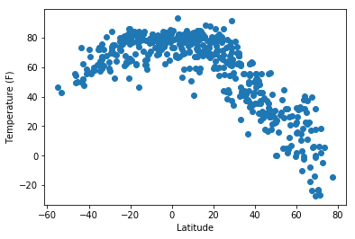
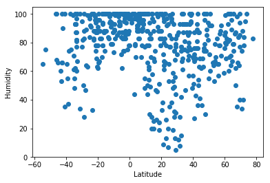
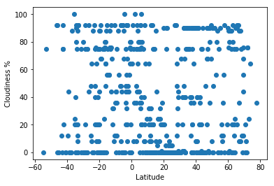
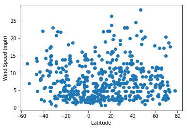

# Weather vs Latitude Analysis

This analysis compares how weather changes across different latitude points. A random selection of 600 cities is selected by latitude and longitude. Because we are dealing with points on a sphere, I looked at http://mathworld.wolfram.com/SpherePointPicking.html as a resource to find how to find cities in a truly random way. The [OpenWeatherMap API](https://openweathermap.org/api) was then used to get weather data.

Graphed results, conclusions, and a marked down jupyter notebook are shown below.

##### Temperature (F) vs. Latitude



##### Humidity (%) vs. Latitude



##### Cloudiness (%) vs. Latitude



##### Wind Speed (mph) vs. Latitude



### Conclusions
1. Temperature increases as latitude gets closer to zero (as predicted)
2. Although latitude doesn't seem to directly effect humidity, it does seem like there are more cities with humidity above 60% than less than 60%
3. There didn't seem to be a direct relationship between windspeed and latitude. 


### Markdown Jupyter Notebook
```python
#Dependencies
from citipy import citipy

import os
import random
import math

import requests
import json
import matplotlib.pyplot as plt
import seaborn as sns
import pandas as pd
import numpy as np
import seaborn as sns
```


```python
# API Info
from config import key

base_url = "http://api.openweathermap.org/data/2.5/weather?"
```


```python
#Generate a random set of 500 latitude and longitude values
rand_lat = []
rand_long = []

for i in range(600):
    rand_long.append(random.uniform(180,-180))
    
    lat = math.degrees(math.acos(2*random.random()-1))-90
    rand_lat.append(lat)

print(rand_long[0:5])
print(rand_lat[0:5])

```

    [113.07068253946069, -111.91595729475983, 40.52031633783611, 85.07072416080211, -79.64037346306657]
    [-10.31213192936157, -49.23587673531683, -23.41032823489276, -24.561043224552805, 31.045179343068156]
    


```python
#initiate city, country lists to be populated within the for loop
cities = []
countries = []
loc_concat_list = []

#find the closest city through each of the 500 random lat/longs

for indexi, i in enumerate(rand_lat):
    
    citi = citipy.nearest_city(i, rand_long[indexi])
    
    cityname =citi.city_name
    countrycd = citi.country_code
    
    loc_concat = cityname + "," + countrycd
    
#Using a while loop: check to see if the location has already been chosen
#If it has, keep generating new lat/longs and city/countries until a unique location is found
    while loc_concat in loc_concat_list:
        
        rand_long[indexi] = random.uniform(180,-180)
        rand_lat[indexi] = math.degrees(math.acos(2*random.random()-1))-90
        
        citi = citipy.nearest_city(rand_lat[indexi], rand_long[indexi])
        
        cityname =citi.city_name
        countrycd = citi.country_code
        
        loc_concat = cityname + "," + countrycd
        #print(loc_concat)
    
#add the randomly generated cities and counties to lists   
    cities.append(cityname)
    countries.append(countrycd)
    loc_concat_list.append(cityname + "," + countrycd)

#print(cities[0:5])
print(loc_concat_list[0:5])
```

    ['manjacaze,mz', 'islamkot,pk', 'newport,us', 'samarai,pg', 'nikolskoye,ru']
    


```python
#create a dataframe of cities and countries
#write the information to a csv

cities_data = pd.DataFrame({"city": cities,"country": countries,"loc_concat":loc_concat_list,"latitude":rand_lat,"longitude":rand_long})

#cities_data.to_csv(path_or_buf="check.csv")
```


```python
#initiate lists to hold api results
api_lon = []
api_lat = []
api_temp = []
api_humid = []
api_cloudiness = []
api_windspeed = []
api_city = []
api_country = []

#loop through all cities, and search/return information from openweather API
for indexi, item in enumerate(loc_concat_list[0:600]):
    if len(api_lon) == 500:
        break
    q_url = base_url + "appid=" + key + "&q=" +item + "&units=imperial"
    weather_response = requests.get(q_url)
    weather_json = weather_response.json()
    print("Processing city: " + str(indexi) +", "+ str(cities[indexi]) +" using " + str(q_url) )
    #print(json.dumps(weather_json,indent=4))
    #place each resulting value in its own list
    try:
        api_lon.append(weather_json["coord"]["lon"])
        api_lat.append(weather_json["coord"]["lat"])
        api_temp.append(weather_json["main"]["temp"]) 
        api_humid.append(weather_json["main"]["humidity"]) #Farenheit
        api_cloudiness.append(weather_json["clouds"]["all"]) #check units
        api_windspeed.append(weather_json["wind"]["speed"]) #miles/hr
        api_city.append(weather_json["name"])
        api_country.append(weather_json["sys"]["country"])

    except KeyError:
        print(cities[indexi] + " cannot be found. Continuing with next city")
        #continue
#print(len(api_lon))
```

    Processing city: 0, manjacaze using http://api.openweathermap.org/data/2.5/weather?appid=25bc90a1196e6f153eece0bc0b0fc9eb&q=manjacaze,mz&units=imperial
    Processing city: 1, islamkot using http://api.openweathermap.org/data/2.5/weather?appid=25bc90a1196e6f153eece0bc0b0fc9eb&q=islamkot,pk&units=imperial
    Processing city: 2, newport using http://api.openweathermap.org/data/2.5/weather?appid=25bc90a1196e6f153eece0bc0b0fc9eb&q=newport,us&units=imperial
    Processing city: 3, samarai using http://api.openweathermap.org/data/2.5/weather?appid=25bc90a1196e6f153eece0bc0b0fc9eb&q=samarai,pg&units=imperial
    Processing city: 4, nikolskoye using http://api.openweathermap.org/data/2.5/weather?appid=25bc90a1196e6f153eece0bc0b0fc9eb&q=nikolskoye,ru&units=imperial
    Processing city: 5, saint george using http://api.openweathermap.org/data/2.5/weather?appid=25bc90a1196e6f153eece0bc0b0fc9eb&q=saint george,bm&units=imperial
    Processing city: 6, puerto ayora using http://api.openweathermap.org/data/2.5/weather?appid=25bc90a1196e6f153eece0bc0b0fc9eb&q=puerto ayora,ec&units=imperial
    Processing city: 7, rikitea using http://api.openweathermap.org/data/2.5/weather?appid=25bc90a1196e6f153eece0bc0b0fc9eb&q=rikitea,pf&units=imperial
    Processing city: 8, esperance using http://api.openweathermap.org/data/2.5/weather?appid=25bc90a1196e6f153eece0bc0b0fc9eb&q=esperance,au&units=imperial
    Processing city: 9, butaritari using http://api.openweathermap.org/data/2.5/weather?appid=25bc90a1196e6f153eece0bc0b0fc9eb&q=butaritari,ki&units=imperial
    Processing city: 10, kununurra using http://api.openweathermap.org/data/2.5/weather?appid=25bc90a1196e6f153eece0bc0b0fc9eb&q=kununurra,au&units=imperial
    Processing city: 11, russell using http://api.openweathermap.org/data/2.5/weather?appid=25bc90a1196e6f153eece0bc0b0fc9eb&q=russell,nz&units=imperial
    Processing city: 12, pavilosta using http://api.openweathermap.org/data/2.5/weather?appid=25bc90a1196e6f153eece0bc0b0fc9eb&q=pavilosta,lv&units=imperial
    Processing city: 13, port elizabeth using http://api.openweathermap.org/data/2.5/weather?appid=25bc90a1196e6f153eece0bc0b0fc9eb&q=port elizabeth,za&units=imperial
    Processing city: 14, lebu using http://api.openweathermap.org/data/2.5/weather?appid=25bc90a1196e6f153eece0bc0b0fc9eb&q=lebu,cl&units=imperial
    Processing city: 15, dickinson using http://api.openweathermap.org/data/2.5/weather?appid=25bc90a1196e6f153eece0bc0b0fc9eb&q=dickinson,us&units=imperial
    Processing city: 16, atar using http://api.openweathermap.org/data/2.5/weather?appid=25bc90a1196e6f153eece0bc0b0fc9eb&q=atar,mr&units=imperial
    Processing city: 17, geraldton using http://api.openweathermap.org/data/2.5/weather?appid=25bc90a1196e6f153eece0bc0b0fc9eb&q=geraldton,au&units=imperial
    Processing city: 18, bengkulu using http://api.openweathermap.org/data/2.5/weather?appid=25bc90a1196e6f153eece0bc0b0fc9eb&q=bengkulu,id&units=imperial
    bengkulu cannot be found. Continuing with next city
    Processing city: 19, kapaa using http://api.openweathermap.org/data/2.5/weather?appid=25bc90a1196e6f153eece0bc0b0fc9eb&q=kapaa,us&units=imperial
    Processing city: 20, san joaquin using http://api.openweathermap.org/data/2.5/weather?appid=25bc90a1196e6f153eece0bc0b0fc9eb&q=san joaquin,bo&units=imperial
    Processing city: 21, luba using http://api.openweathermap.org/data/2.5/weather?appid=25bc90a1196e6f153eece0bc0b0fc9eb&q=luba,gq&units=imperial
    Processing city: 22, namibe using http://api.openweathermap.org/data/2.5/weather?appid=25bc90a1196e6f153eece0bc0b0fc9eb&q=namibe,ao&units=imperial
    Processing city: 23, asau using http://api.openweathermap.org/data/2.5/weather?appid=25bc90a1196e6f153eece0bc0b0fc9eb&q=asau,tv&units=imperial
    asau cannot be found. Continuing with next city
    Processing city: 24, ushuaia using http://api.openweathermap.org/data/2.5/weather?appid=25bc90a1196e6f153eece0bc0b0fc9eb&q=ushuaia,ar&units=imperial
    Processing city: 25, katsuura using http://api.openweathermap.org/data/2.5/weather?appid=25bc90a1196e6f153eece0bc0b0fc9eb&q=katsuura,jp&units=imperial
    Processing city: 26, marcona using http://api.openweathermap.org/data/2.5/weather?appid=25bc90a1196e6f153eece0bc0b0fc9eb&q=marcona,pe&units=imperial
    marcona cannot be found. Continuing with next city
    Processing city: 27, new norfolk using http://api.openweathermap.org/data/2.5/weather?appid=25bc90a1196e6f153eece0bc0b0fc9eb&q=new norfolk,au&units=imperial
    Processing city: 28, suntar using http://api.openweathermap.org/data/2.5/weather?appid=25bc90a1196e6f153eece0bc0b0fc9eb&q=suntar,ru&units=imperial
    Processing city: 29, mataura using http://api.openweathermap.org/data/2.5/weather?appid=25bc90a1196e6f153eece0bc0b0fc9eb&q=mataura,pf&units=imperial
    mataura cannot be found. Continuing with next city
    Processing city: 30, east london using http://api.openweathermap.org/data/2.5/weather?appid=25bc90a1196e6f153eece0bc0b0fc9eb&q=east london,za&units=imperial
    Processing city: 31, sovetskiy using http://api.openweathermap.org/data/2.5/weather?appid=25bc90a1196e6f153eece0bc0b0fc9eb&q=sovetskiy,ru&units=imperial
    Processing city: 32, ituni using http://api.openweathermap.org/data/2.5/weather?appid=25bc90a1196e6f153eece0bc0b0fc9eb&q=ituni,gy&units=imperial
    ituni cannot be found. Continuing with next city
    Processing city: 33, san pedro using http://api.openweathermap.org/data/2.5/weather?appid=25bc90a1196e6f153eece0bc0b0fc9eb&q=san pedro,ar&units=imperial
    Processing city: 34, prince rupert using http://api.openweathermap.org/data/2.5/weather?appid=25bc90a1196e6f153eece0bc0b0fc9eb&q=prince rupert,ca&units=imperial
    Processing city: 35, georgetown using http://api.openweathermap.org/data/2.5/weather?appid=25bc90a1196e6f153eece0bc0b0fc9eb&q=georgetown,us&units=imperial
    Processing city: 36, grand river south east using http://api.openweathermap.org/data/2.5/weather?appid=25bc90a1196e6f153eece0bc0b0fc9eb&q=grand river south east,mu&units=imperial
    grand river south east cannot be found. Continuing with next city
    Processing city: 37, samusu using http://api.openweathermap.org/data/2.5/weather?appid=25bc90a1196e6f153eece0bc0b0fc9eb&q=samusu,ws&units=imperial
    samusu cannot be found. Continuing with next city
    Processing city: 38, porto recanati using http://api.openweathermap.org/data/2.5/weather?appid=25bc90a1196e6f153eece0bc0b0fc9eb&q=porto recanati,it&units=imperial
    Processing city: 39, airai using http://api.openweathermap.org/data/2.5/weather?appid=25bc90a1196e6f153eece0bc0b0fc9eb&q=airai,pw&units=imperial
    airai cannot be found. Continuing with next city
    Processing city: 40, lagoa using http://api.openweathermap.org/data/2.5/weather?appid=25bc90a1196e6f153eece0bc0b0fc9eb&q=lagoa,pt&units=imperial
    Processing city: 41, faanui using http://api.openweathermap.org/data/2.5/weather?appid=25bc90a1196e6f153eece0bc0b0fc9eb&q=faanui,pf&units=imperial
    Processing city: 42, brunsbuttel using http://api.openweathermap.org/data/2.5/weather?appid=25bc90a1196e6f153eece0bc0b0fc9eb&q=brunsbuttel,de&units=imperial
    Processing city: 43, severo-kurilsk using http://api.openweathermap.org/data/2.5/weather?appid=25bc90a1196e6f153eece0bc0b0fc9eb&q=severo-kurilsk,ru&units=imperial
    Processing city: 44, yellowknife using http://api.openweathermap.org/data/2.5/weather?appid=25bc90a1196e6f153eece0bc0b0fc9eb&q=yellowknife,ca&units=imperial
    Processing city: 45, paamiut using http://api.openweathermap.org/data/2.5/weather?appid=25bc90a1196e6f153eece0bc0b0fc9eb&q=paamiut,gl&units=imperial
    Processing city: 46, arraial do cabo using http://api.openweathermap.org/data/2.5/weather?appid=25bc90a1196e6f153eece0bc0b0fc9eb&q=arraial do cabo,br&units=imperial
    Processing city: 47, kandi using http://api.openweathermap.org/data/2.5/weather?appid=25bc90a1196e6f153eece0bc0b0fc9eb&q=kandi,bj&units=imperial
    Processing city: 48, jarjis using http://api.openweathermap.org/data/2.5/weather?appid=25bc90a1196e6f153eece0bc0b0fc9eb&q=jarjis,tn&units=imperial
    jarjis cannot be found. Continuing with next city
    Processing city: 49, avarua using http://api.openweathermap.org/data/2.5/weather?appid=25bc90a1196e6f153eece0bc0b0fc9eb&q=avarua,ck&units=imperial
    Processing city: 50, tirodi using http://api.openweathermap.org/data/2.5/weather?appid=25bc90a1196e6f153eece0bc0b0fc9eb&q=tirodi,in&units=imperial
    Processing city: 51, tucurui using http://api.openweathermap.org/data/2.5/weather?appid=25bc90a1196e6f153eece0bc0b0fc9eb&q=tucurui,br&units=imperial
    Processing city: 52, cape town using http://api.openweathermap.org/data/2.5/weather?appid=25bc90a1196e6f153eece0bc0b0fc9eb&q=cape town,za&units=imperial
    Processing city: 53, castro using http://api.openweathermap.org/data/2.5/weather?appid=25bc90a1196e6f153eece0bc0b0fc9eb&q=castro,cl&units=imperial
    Processing city: 54, nouadhibou using http://api.openweathermap.org/data/2.5/weather?appid=25bc90a1196e6f153eece0bc0b0fc9eb&q=nouadhibou,mr&units=imperial
    Processing city: 55, atuona using http://api.openweathermap.org/data/2.5/weather?appid=25bc90a1196e6f153eece0bc0b0fc9eb&q=atuona,pf&units=imperial
    Processing city: 56, codrington using http://api.openweathermap.org/data/2.5/weather?appid=25bc90a1196e6f153eece0bc0b0fc9eb&q=codrington,ag&units=imperial
    codrington cannot be found. Continuing with next city
    Processing city: 57, san patricio using http://api.openweathermap.org/data/2.5/weather?appid=25bc90a1196e6f153eece0bc0b0fc9eb&q=san patricio,mx&units=imperial
    Processing city: 58, maceio using http://api.openweathermap.org/data/2.5/weather?appid=25bc90a1196e6f153eece0bc0b0fc9eb&q=maceio,br&units=imperial
    Processing city: 59, coquimbo using http://api.openweathermap.org/data/2.5/weather?appid=25bc90a1196e6f153eece0bc0b0fc9eb&q=coquimbo,cl&units=imperial
    Processing city: 60, changping using http://api.openweathermap.org/data/2.5/weather?appid=25bc90a1196e6f153eece0bc0b0fc9eb&q=changping,cn&units=imperial
    Processing city: 61, beloha using http://api.openweathermap.org/data/2.5/weather?appid=25bc90a1196e6f153eece0bc0b0fc9eb&q=beloha,mg&units=imperial
    Processing city: 62, longonjo using http://api.openweathermap.org/data/2.5/weather?appid=25bc90a1196e6f153eece0bc0b0fc9eb&q=longonjo,ao&units=imperial
    Processing city: 63, ahipara using http://api.openweathermap.org/data/2.5/weather?appid=25bc90a1196e6f153eece0bc0b0fc9eb&q=ahipara,nz&units=imperial
    Processing city: 64, guerrero negro using http://api.openweathermap.org/data/2.5/weather?appid=25bc90a1196e6f153eece0bc0b0fc9eb&q=guerrero negro,mx&units=imperial
    Processing city: 65, cabo san lucas using http://api.openweathermap.org/data/2.5/weather?appid=25bc90a1196e6f153eece0bc0b0fc9eb&q=cabo san lucas,mx&units=imperial
    Processing city: 66, hilo using http://api.openweathermap.org/data/2.5/weather?appid=25bc90a1196e6f153eece0bc0b0fc9eb&q=hilo,us&units=imperial
    Processing city: 67, bonthe using http://api.openweathermap.org/data/2.5/weather?appid=25bc90a1196e6f153eece0bc0b0fc9eb&q=bonthe,sl&units=imperial
    Processing city: 68, port-de-paix using http://api.openweathermap.org/data/2.5/weather?appid=25bc90a1196e6f153eece0bc0b0fc9eb&q=port-de-paix,ht&units=imperial
    port-de-paix cannot be found. Continuing with next city
    Processing city: 69, keningau using http://api.openweathermap.org/data/2.5/weather?appid=25bc90a1196e6f153eece0bc0b0fc9eb&q=keningau,my&units=imperial
    Processing city: 70, bay roberts using http://api.openweathermap.org/data/2.5/weather?appid=25bc90a1196e6f153eece0bc0b0fc9eb&q=bay roberts,ca&units=imperial
    Processing city: 71, mar del plata using http://api.openweathermap.org/data/2.5/weather?appid=25bc90a1196e6f153eece0bc0b0fc9eb&q=mar del plata,ar&units=imperial
    Processing city: 72, thompson using http://api.openweathermap.org/data/2.5/weather?appid=25bc90a1196e6f153eece0bc0b0fc9eb&q=thompson,ca&units=imperial
    Processing city: 73, vostok using http://api.openweathermap.org/data/2.5/weather?appid=25bc90a1196e6f153eece0bc0b0fc9eb&q=vostok,ru&units=imperial
    Processing city: 74, plouzane using http://api.openweathermap.org/data/2.5/weather?appid=25bc90a1196e6f153eece0bc0b0fc9eb&q=plouzane,fr&units=imperial
    Processing city: 75, kavieng using http://api.openweathermap.org/data/2.5/weather?appid=25bc90a1196e6f153eece0bc0b0fc9eb&q=kavieng,pg&units=imperial
    Processing city: 76, phan rang using http://api.openweathermap.org/data/2.5/weather?appid=25bc90a1196e6f153eece0bc0b0fc9eb&q=phan rang,vn&units=imperial
    phan rang cannot be found. Continuing with next city
    Processing city: 77, novokayakent using http://api.openweathermap.org/data/2.5/weather?appid=25bc90a1196e6f153eece0bc0b0fc9eb&q=novokayakent,ru&units=imperial
    Processing city: 78, vaini using http://api.openweathermap.org/data/2.5/weather?appid=25bc90a1196e6f153eece0bc0b0fc9eb&q=vaini,to&units=imperial
    Processing city: 79, isiro using http://api.openweathermap.org/data/2.5/weather?appid=25bc90a1196e6f153eece0bc0b0fc9eb&q=isiro,cd&units=imperial
    Processing city: 80, gornopravdinsk using http://api.openweathermap.org/data/2.5/weather?appid=25bc90a1196e6f153eece0bc0b0fc9eb&q=gornopravdinsk,ru&units=imperial
    Processing city: 81, georgetown using http://api.openweathermap.org/data/2.5/weather?appid=25bc90a1196e6f153eece0bc0b0fc9eb&q=georgetown,sh&units=imperial
    Processing city: 82, neuquen using http://api.openweathermap.org/data/2.5/weather?appid=25bc90a1196e6f153eece0bc0b0fc9eb&q=neuquen,ar&units=imperial
    Processing city: 83, pemangkat using http://api.openweathermap.org/data/2.5/weather?appid=25bc90a1196e6f153eece0bc0b0fc9eb&q=pemangkat,id&units=imperial
    pemangkat cannot be found. Continuing with next city
    Processing city: 84, aklavik using http://api.openweathermap.org/data/2.5/weather?appid=25bc90a1196e6f153eece0bc0b0fc9eb&q=aklavik,ca&units=imperial
    Processing city: 85, kungurtug using http://api.openweathermap.org/data/2.5/weather?appid=25bc90a1196e6f153eece0bc0b0fc9eb&q=kungurtug,ru&units=imperial
    Processing city: 86, longyan using http://api.openweathermap.org/data/2.5/weather?appid=25bc90a1196e6f153eece0bc0b0fc9eb&q=longyan,cn&units=imperial
    Processing city: 87, namatanai using http://api.openweathermap.org/data/2.5/weather?appid=25bc90a1196e6f153eece0bc0b0fc9eb&q=namatanai,pg&units=imperial
    Processing city: 88, busselton using http://api.openweathermap.org/data/2.5/weather?appid=25bc90a1196e6f153eece0bc0b0fc9eb&q=busselton,au&units=imperial
    Processing city: 89, henties bay using http://api.openweathermap.org/data/2.5/weather?appid=25bc90a1196e6f153eece0bc0b0fc9eb&q=henties bay,na&units=imperial
    Processing city: 90, bethel using http://api.openweathermap.org/data/2.5/weather?appid=25bc90a1196e6f153eece0bc0b0fc9eb&q=bethel,us&units=imperial
    Processing city: 91, chipinge using http://api.openweathermap.org/data/2.5/weather?appid=25bc90a1196e6f153eece0bc0b0fc9eb&q=chipinge,zw&units=imperial
    Processing city: 92, half moon bay using http://api.openweathermap.org/data/2.5/weather?appid=25bc90a1196e6f153eece0bc0b0fc9eb&q=half moon bay,us&units=imperial
    Processing city: 93, taolanaro using http://api.openweathermap.org/data/2.5/weather?appid=25bc90a1196e6f153eece0bc0b0fc9eb&q=taolanaro,mg&units=imperial
    taolanaro cannot be found. Continuing with next city
    Processing city: 94, illoqqortoormiut using http://api.openweathermap.org/data/2.5/weather?appid=25bc90a1196e6f153eece0bc0b0fc9eb&q=illoqqortoormiut,gl&units=imperial
    illoqqortoormiut cannot be found. Continuing with next city
    Processing city: 95, asfi using http://api.openweathermap.org/data/2.5/weather?appid=25bc90a1196e6f153eece0bc0b0fc9eb&q=asfi,ma&units=imperial
    asfi cannot be found. Continuing with next city
    Processing city: 96, saskylakh using http://api.openweathermap.org/data/2.5/weather?appid=25bc90a1196e6f153eece0bc0b0fc9eb&q=saskylakh,ru&units=imperial
    Processing city: 97, vilyuysk using http://api.openweathermap.org/data/2.5/weather?appid=25bc90a1196e6f153eece0bc0b0fc9eb&q=vilyuysk,ru&units=imperial
    Processing city: 98, ilave using http://api.openweathermap.org/data/2.5/weather?appid=25bc90a1196e6f153eece0bc0b0fc9eb&q=ilave,pe&units=imperial
    Processing city: 99, clarence town using http://api.openweathermap.org/data/2.5/weather?appid=25bc90a1196e6f153eece0bc0b0fc9eb&q=clarence town,bs&units=imperial
    Processing city: 100, udachnyy using http://api.openweathermap.org/data/2.5/weather?appid=25bc90a1196e6f153eece0bc0b0fc9eb&q=udachnyy,ru&units=imperial
    Processing city: 101, kulhudhuffushi using http://api.openweathermap.org/data/2.5/weather?appid=25bc90a1196e6f153eece0bc0b0fc9eb&q=kulhudhuffushi,mv&units=imperial
    Processing city: 102, kaduqli using http://api.openweathermap.org/data/2.5/weather?appid=25bc90a1196e6f153eece0bc0b0fc9eb&q=kaduqli,sd&units=imperial
    Processing city: 103, bodden town using http://api.openweathermap.org/data/2.5/weather?appid=25bc90a1196e6f153eece0bc0b0fc9eb&q=bodden town,ky&units=imperial
    Processing city: 104, hermanus using http://api.openweathermap.org/data/2.5/weather?appid=25bc90a1196e6f153eece0bc0b0fc9eb&q=hermanus,za&units=imperial
    Processing city: 105, betare oya using http://api.openweathermap.org/data/2.5/weather?appid=25bc90a1196e6f153eece0bc0b0fc9eb&q=betare oya,cm&units=imperial
    Processing city: 106, inhambane using http://api.openweathermap.org/data/2.5/weather?appid=25bc90a1196e6f153eece0bc0b0fc9eb&q=inhambane,mz&units=imperial
    Processing city: 107, upernavik using http://api.openweathermap.org/data/2.5/weather?appid=25bc90a1196e6f153eece0bc0b0fc9eb&q=upernavik,gl&units=imperial
    Processing city: 108, rawah using http://api.openweathermap.org/data/2.5/weather?appid=25bc90a1196e6f153eece0bc0b0fc9eb&q=rawah,iq&units=imperial
    rawah cannot be found. Continuing with next city
    Processing city: 109, xining using http://api.openweathermap.org/data/2.5/weather?appid=25bc90a1196e6f153eece0bc0b0fc9eb&q=xining,cn&units=imperial
    Processing city: 110, albany using http://api.openweathermap.org/data/2.5/weather?appid=25bc90a1196e6f153eece0bc0b0fc9eb&q=albany,au&units=imperial
    Processing city: 111, mayor pablo lagerenza using http://api.openweathermap.org/data/2.5/weather?appid=25bc90a1196e6f153eece0bc0b0fc9eb&q=mayor pablo lagerenza,py&units=imperial
    Processing city: 112, punta arenas using http://api.openweathermap.org/data/2.5/weather?appid=25bc90a1196e6f153eece0bc0b0fc9eb&q=punta arenas,cl&units=imperial
    Processing city: 113, nishihara using http://api.openweathermap.org/data/2.5/weather?appid=25bc90a1196e6f153eece0bc0b0fc9eb&q=nishihara,jp&units=imperial
    Processing city: 114, chuy using http://api.openweathermap.org/data/2.5/weather?appid=25bc90a1196e6f153eece0bc0b0fc9eb&q=chuy,uy&units=imperial
    Processing city: 115, wadhwan using http://api.openweathermap.org/data/2.5/weather?appid=25bc90a1196e6f153eece0bc0b0fc9eb&q=wadhwan,in&units=imperial
    wadhwan cannot be found. Continuing with next city
    Processing city: 116, bambous virieux using http://api.openweathermap.org/data/2.5/weather?appid=25bc90a1196e6f153eece0bc0b0fc9eb&q=bambous virieux,mu&units=imperial
    Processing city: 117, mazamari using http://api.openweathermap.org/data/2.5/weather?appid=25bc90a1196e6f153eece0bc0b0fc9eb&q=mazamari,pe&units=imperial
    Processing city: 118, dikson using http://api.openweathermap.org/data/2.5/weather?appid=25bc90a1196e6f153eece0bc0b0fc9eb&q=dikson,ru&units=imperial
    Processing city: 119, ngukurr using http://api.openweathermap.org/data/2.5/weather?appid=25bc90a1196e6f153eece0bc0b0fc9eb&q=ngukurr,au&units=imperial
    ngukurr cannot be found. Continuing with next city
    Processing city: 120, big spring using http://api.openweathermap.org/data/2.5/weather?appid=25bc90a1196e6f153eece0bc0b0fc9eb&q=big spring,us&units=imperial
    Processing city: 121, lakatoro using http://api.openweathermap.org/data/2.5/weather?appid=25bc90a1196e6f153eece0bc0b0fc9eb&q=lakatoro,vu&units=imperial
    Processing city: 122, port-gentil using http://api.openweathermap.org/data/2.5/weather?appid=25bc90a1196e6f153eece0bc0b0fc9eb&q=port-gentil,ga&units=imperial
    Processing city: 123, asyut using http://api.openweathermap.org/data/2.5/weather?appid=25bc90a1196e6f153eece0bc0b0fc9eb&q=asyut,eg&units=imperial
    Processing city: 124, kirovskiy using http://api.openweathermap.org/data/2.5/weather?appid=25bc90a1196e6f153eece0bc0b0fc9eb&q=kirovskiy,ru&units=imperial
    Processing city: 125, broome using http://api.openweathermap.org/data/2.5/weather?appid=25bc90a1196e6f153eece0bc0b0fc9eb&q=broome,au&units=imperial
    Processing city: 126, ambon using http://api.openweathermap.org/data/2.5/weather?appid=25bc90a1196e6f153eece0bc0b0fc9eb&q=ambon,id&units=imperial
    Processing city: 127, hithadhoo using http://api.openweathermap.org/data/2.5/weather?appid=25bc90a1196e6f153eece0bc0b0fc9eb&q=hithadhoo,mv&units=imperial
    Processing city: 128, jamestown using http://api.openweathermap.org/data/2.5/weather?appid=25bc90a1196e6f153eece0bc0b0fc9eb&q=jamestown,sh&units=imperial
    Processing city: 129, trinidad using http://api.openweathermap.org/data/2.5/weather?appid=25bc90a1196e6f153eece0bc0b0fc9eb&q=trinidad,bo&units=imperial
    Processing city: 130, sanford using http://api.openweathermap.org/data/2.5/weather?appid=25bc90a1196e6f153eece0bc0b0fc9eb&q=sanford,us&units=imperial
    Processing city: 131, cassilandia using http://api.openweathermap.org/data/2.5/weather?appid=25bc90a1196e6f153eece0bc0b0fc9eb&q=cassilandia,br&units=imperial
    Processing city: 132, sarangani using http://api.openweathermap.org/data/2.5/weather?appid=25bc90a1196e6f153eece0bc0b0fc9eb&q=sarangani,ph&units=imperial
    Processing city: 133, richards bay using http://api.openweathermap.org/data/2.5/weather?appid=25bc90a1196e6f153eece0bc0b0fc9eb&q=richards bay,za&units=imperial
    Processing city: 134, riyaq using http://api.openweathermap.org/data/2.5/weather?appid=25bc90a1196e6f153eece0bc0b0fc9eb&q=riyaq,lb&units=imperial
    riyaq cannot be found. Continuing with next city
    Processing city: 135, leiyang using http://api.openweathermap.org/data/2.5/weather?appid=25bc90a1196e6f153eece0bc0b0fc9eb&q=leiyang,cn&units=imperial
    Processing city: 136, bredasdorp using http://api.openweathermap.org/data/2.5/weather?appid=25bc90a1196e6f153eece0bc0b0fc9eb&q=bredasdorp,za&units=imperial
    Processing city: 137, ola using http://api.openweathermap.org/data/2.5/weather?appid=25bc90a1196e6f153eece0bc0b0fc9eb&q=ola,ru&units=imperial
    Processing city: 138, socorro using http://api.openweathermap.org/data/2.5/weather?appid=25bc90a1196e6f153eece0bc0b0fc9eb&q=socorro,us&units=imperial
    Processing city: 139, laguna using http://api.openweathermap.org/data/2.5/weather?appid=25bc90a1196e6f153eece0bc0b0fc9eb&q=laguna,br&units=imperial
    laguna cannot be found. Continuing with next city
    Processing city: 140, palabuhanratu using http://api.openweathermap.org/data/2.5/weather?appid=25bc90a1196e6f153eece0bc0b0fc9eb&q=palabuhanratu,id&units=imperial
    palabuhanratu cannot be found. Continuing with next city
    Processing city: 141, suining using http://api.openweathermap.org/data/2.5/weather?appid=25bc90a1196e6f153eece0bc0b0fc9eb&q=suining,cn&units=imperial
    Processing city: 142, karimganj using http://api.openweathermap.org/data/2.5/weather?appid=25bc90a1196e6f153eece0bc0b0fc9eb&q=karimganj,in&units=imperial
    Processing city: 143, naliya using http://api.openweathermap.org/data/2.5/weather?appid=25bc90a1196e6f153eece0bc0b0fc9eb&q=naliya,in&units=imperial
    Processing city: 144, sawakin using http://api.openweathermap.org/data/2.5/weather?appid=25bc90a1196e6f153eece0bc0b0fc9eb&q=sawakin,sd&units=imperial
    Processing city: 145, yokadouma using http://api.openweathermap.org/data/2.5/weather?appid=25bc90a1196e6f153eece0bc0b0fc9eb&q=yokadouma,cm&units=imperial
    Processing city: 146, ballina using http://api.openweathermap.org/data/2.5/weather?appid=25bc90a1196e6f153eece0bc0b0fc9eb&q=ballina,au&units=imperial
    Processing city: 147, beringovskiy using http://api.openweathermap.org/data/2.5/weather?appid=25bc90a1196e6f153eece0bc0b0fc9eb&q=beringovskiy,ru&units=imperial
    Processing city: 148, byron bay using http://api.openweathermap.org/data/2.5/weather?appid=25bc90a1196e6f153eece0bc0b0fc9eb&q=byron bay,au&units=imperial
    Processing city: 149, kannabe using http://api.openweathermap.org/data/2.5/weather?appid=25bc90a1196e6f153eece0bc0b0fc9eb&q=kannabe,jp&units=imperial
    Processing city: 150, fortuna using http://api.openweathermap.org/data/2.5/weather?appid=25bc90a1196e6f153eece0bc0b0fc9eb&q=fortuna,us&units=imperial
    Processing city: 151, belushya guba using http://api.openweathermap.org/data/2.5/weather?appid=25bc90a1196e6f153eece0bc0b0fc9eb&q=belushya guba,ru&units=imperial
    belushya guba cannot be found. Continuing with next city
    Processing city: 152, mahebourg using http://api.openweathermap.org/data/2.5/weather?appid=25bc90a1196e6f153eece0bc0b0fc9eb&q=mahebourg,mu&units=imperial
    Processing city: 153, eureka using http://api.openweathermap.org/data/2.5/weather?appid=25bc90a1196e6f153eece0bc0b0fc9eb&q=eureka,us&units=imperial
    Processing city: 154, marystown using http://api.openweathermap.org/data/2.5/weather?appid=25bc90a1196e6f153eece0bc0b0fc9eb&q=marystown,ca&units=imperial
    Processing city: 155, rawson using http://api.openweathermap.org/data/2.5/weather?appid=25bc90a1196e6f153eece0bc0b0fc9eb&q=rawson,ar&units=imperial
    Processing city: 156, dianopolis using http://api.openweathermap.org/data/2.5/weather?appid=25bc90a1196e6f153eece0bc0b0fc9eb&q=dianopolis,br&units=imperial
    dianopolis cannot be found. Continuing with next city
    Processing city: 157, road town using http://api.openweathermap.org/data/2.5/weather?appid=25bc90a1196e6f153eece0bc0b0fc9eb&q=road town,vg&units=imperial
    Processing city: 158, ribeira grande using http://api.openweathermap.org/data/2.5/weather?appid=25bc90a1196e6f153eece0bc0b0fc9eb&q=ribeira grande,pt&units=imperial
    Processing city: 159, nioro using http://api.openweathermap.org/data/2.5/weather?appid=25bc90a1196e6f153eece0bc0b0fc9eb&q=nioro,ml&units=imperial
    nioro cannot be found. Continuing with next city
    Processing city: 160, gouyave using http://api.openweathermap.org/data/2.5/weather?appid=25bc90a1196e6f153eece0bc0b0fc9eb&q=gouyave,gd&units=imperial
    Processing city: 161, necochea using http://api.openweathermap.org/data/2.5/weather?appid=25bc90a1196e6f153eece0bc0b0fc9eb&q=necochea,ar&units=imperial
    Processing city: 162, tongren using http://api.openweathermap.org/data/2.5/weather?appid=25bc90a1196e6f153eece0bc0b0fc9eb&q=tongren,cn&units=imperial
    Processing city: 163, sinnamary using http://api.openweathermap.org/data/2.5/weather?appid=25bc90a1196e6f153eece0bc0b0fc9eb&q=sinnamary,gf&units=imperial
    Processing city: 164, la reforma using http://api.openweathermap.org/data/2.5/weather?appid=25bc90a1196e6f153eece0bc0b0fc9eb&q=la reforma,mx&units=imperial
    Processing city: 165, maibong using http://api.openweathermap.org/data/2.5/weather?appid=25bc90a1196e6f153eece0bc0b0fc9eb&q=maibong,in&units=imperial
    Processing city: 166, yerbogachen using http://api.openweathermap.org/data/2.5/weather?appid=25bc90a1196e6f153eece0bc0b0fc9eb&q=yerbogachen,ru&units=imperial
    Processing city: 167, nemuro using http://api.openweathermap.org/data/2.5/weather?appid=25bc90a1196e6f153eece0bc0b0fc9eb&q=nemuro,jp&units=imperial
    Processing city: 168, ca mau using http://api.openweathermap.org/data/2.5/weather?appid=25bc90a1196e6f153eece0bc0b0fc9eb&q=ca mau,vn&units=imperial
    Processing city: 169, pordenone using http://api.openweathermap.org/data/2.5/weather?appid=25bc90a1196e6f153eece0bc0b0fc9eb&q=pordenone,it&units=imperial
    Processing city: 170, totma using http://api.openweathermap.org/data/2.5/weather?appid=25bc90a1196e6f153eece0bc0b0fc9eb&q=totma,ru&units=imperial
    Processing city: 171, kloulklubed using http://api.openweathermap.org/data/2.5/weather?appid=25bc90a1196e6f153eece0bc0b0fc9eb&q=kloulklubed,pw&units=imperial
    Processing city: 172, hami using http://api.openweathermap.org/data/2.5/weather?appid=25bc90a1196e6f153eece0bc0b0fc9eb&q=hami,cn&units=imperial
    Processing city: 173, souillac using http://api.openweathermap.org/data/2.5/weather?appid=25bc90a1196e6f153eece0bc0b0fc9eb&q=souillac,mu&units=imperial
    Processing city: 174, caravelas using http://api.openweathermap.org/data/2.5/weather?appid=25bc90a1196e6f153eece0bc0b0fc9eb&q=caravelas,br&units=imperial
    Processing city: 175, vaitape using http://api.openweathermap.org/data/2.5/weather?appid=25bc90a1196e6f153eece0bc0b0fc9eb&q=vaitape,pf&units=imperial
    Processing city: 176, pilkhuwa using http://api.openweathermap.org/data/2.5/weather?appid=25bc90a1196e6f153eece0bc0b0fc9eb&q=pilkhuwa,in&units=imperial
    Processing city: 177, artyk using http://api.openweathermap.org/data/2.5/weather?appid=25bc90a1196e6f153eece0bc0b0fc9eb&q=artyk,ru&units=imperial
    artyk cannot be found. Continuing with next city
    Processing city: 178, keti bandar using http://api.openweathermap.org/data/2.5/weather?appid=25bc90a1196e6f153eece0bc0b0fc9eb&q=keti bandar,pk&units=imperial
    Processing city: 179, dharchula using http://api.openweathermap.org/data/2.5/weather?appid=25bc90a1196e6f153eece0bc0b0fc9eb&q=dharchula,in&units=imperial
    Processing city: 180, yining using http://api.openweathermap.org/data/2.5/weather?appid=25bc90a1196e6f153eece0bc0b0fc9eb&q=yining,cn&units=imperial
    Processing city: 181, touros using http://api.openweathermap.org/data/2.5/weather?appid=25bc90a1196e6f153eece0bc0b0fc9eb&q=touros,br&units=imperial
    Processing city: 182, saleaula using http://api.openweathermap.org/data/2.5/weather?appid=25bc90a1196e6f153eece0bc0b0fc9eb&q=saleaula,ws&units=imperial
    saleaula cannot be found. Continuing with next city
    Processing city: 183, la libertad using http://api.openweathermap.org/data/2.5/weather?appid=25bc90a1196e6f153eece0bc0b0fc9eb&q=la libertad,sv&units=imperial
    Processing city: 184, inirida using http://api.openweathermap.org/data/2.5/weather?appid=25bc90a1196e6f153eece0bc0b0fc9eb&q=inirida,co&units=imperial
    Processing city: 185, constitucion using http://api.openweathermap.org/data/2.5/weather?appid=25bc90a1196e6f153eece0bc0b0fc9eb&q=constitucion,mx&units=imperial
    Processing city: 186, cockburn town using http://api.openweathermap.org/data/2.5/weather?appid=25bc90a1196e6f153eece0bc0b0fc9eb&q=cockburn town,tc&units=imperial
    Processing city: 187, gayeri using http://api.openweathermap.org/data/2.5/weather?appid=25bc90a1196e6f153eece0bc0b0fc9eb&q=gayeri,bf&units=imperial
    Processing city: 188, pierre using http://api.openweathermap.org/data/2.5/weather?appid=25bc90a1196e6f153eece0bc0b0fc9eb&q=pierre,us&units=imperial
    Processing city: 189, carnarvon using http://api.openweathermap.org/data/2.5/weather?appid=25bc90a1196e6f153eece0bc0b0fc9eb&q=carnarvon,au&units=imperial
    Processing city: 190, misratah using http://api.openweathermap.org/data/2.5/weather?appid=25bc90a1196e6f153eece0bc0b0fc9eb&q=misratah,ly&units=imperial
    Processing city: 191, atambua using http://api.openweathermap.org/data/2.5/weather?appid=25bc90a1196e6f153eece0bc0b0fc9eb&q=atambua,id&units=imperial
    Processing city: 192, tsihombe using http://api.openweathermap.org/data/2.5/weather?appid=25bc90a1196e6f153eece0bc0b0fc9eb&q=tsihombe,mg&units=imperial
    tsihombe cannot be found. Continuing with next city
    Processing city: 193, malpe using http://api.openweathermap.org/data/2.5/weather?appid=25bc90a1196e6f153eece0bc0b0fc9eb&q=malpe,in&units=imperial
    Processing city: 194, karratha using http://api.openweathermap.org/data/2.5/weather?appid=25bc90a1196e6f153eece0bc0b0fc9eb&q=karratha,au&units=imperial
    Processing city: 195, maumelle using http://api.openweathermap.org/data/2.5/weather?appid=25bc90a1196e6f153eece0bc0b0fc9eb&q=maumelle,us&units=imperial
    Processing city: 196, candido mendes using http://api.openweathermap.org/data/2.5/weather?appid=25bc90a1196e6f153eece0bc0b0fc9eb&q=candido mendes,br&units=imperial
    Processing city: 197, payo using http://api.openweathermap.org/data/2.5/weather?appid=25bc90a1196e6f153eece0bc0b0fc9eb&q=payo,ph&units=imperial
    payo cannot be found. Continuing with next city
    Processing city: 198, kristiinankaupunki using http://api.openweathermap.org/data/2.5/weather?appid=25bc90a1196e6f153eece0bc0b0fc9eb&q=kristiinankaupunki,fi&units=imperial
    kristiinankaupunki cannot be found. Continuing with next city
    Processing city: 199, catia la mar using http://api.openweathermap.org/data/2.5/weather?appid=25bc90a1196e6f153eece0bc0b0fc9eb&q=catia la mar,ve&units=imperial
    Processing city: 200, saint-pierre using http://api.openweathermap.org/data/2.5/weather?appid=25bc90a1196e6f153eece0bc0b0fc9eb&q=saint-pierre,pm&units=imperial
    Processing city: 201, riyadh using http://api.openweathermap.org/data/2.5/weather?appid=25bc90a1196e6f153eece0bc0b0fc9eb&q=riyadh,sa&units=imperial
    Processing city: 202, anuradhapura using http://api.openweathermap.org/data/2.5/weather?appid=25bc90a1196e6f153eece0bc0b0fc9eb&q=anuradhapura,lk&units=imperial
    Processing city: 203, rafai using http://api.openweathermap.org/data/2.5/weather?appid=25bc90a1196e6f153eece0bc0b0fc9eb&q=rafai,cf&units=imperial
    Processing city: 204, hokitika using http://api.openweathermap.org/data/2.5/weather?appid=25bc90a1196e6f153eece0bc0b0fc9eb&q=hokitika,nz&units=imperial
    Processing city: 205, toliary using http://api.openweathermap.org/data/2.5/weather?appid=25bc90a1196e6f153eece0bc0b0fc9eb&q=toliary,mg&units=imperial
    toliary cannot be found. Continuing with next city
    Processing city: 206, waiouru using http://api.openweathermap.org/data/2.5/weather?appid=25bc90a1196e6f153eece0bc0b0fc9eb&q=waiouru,nz&units=imperial
    Processing city: 207, isangel using http://api.openweathermap.org/data/2.5/weather?appid=25bc90a1196e6f153eece0bc0b0fc9eb&q=isangel,vu&units=imperial
    Processing city: 208, sur using http://api.openweathermap.org/data/2.5/weather?appid=25bc90a1196e6f153eece0bc0b0fc9eb&q=sur,om&units=imperial
    Processing city: 209, hamilton using http://api.openweathermap.org/data/2.5/weather?appid=25bc90a1196e6f153eece0bc0b0fc9eb&q=hamilton,bm&units=imperial
    Processing city: 210, muros using http://api.openweathermap.org/data/2.5/weather?appid=25bc90a1196e6f153eece0bc0b0fc9eb&q=muros,es&units=imperial
    Processing city: 211, kudahuvadhoo using http://api.openweathermap.org/data/2.5/weather?appid=25bc90a1196e6f153eece0bc0b0fc9eb&q=kudahuvadhoo,mv&units=imperial
    Processing city: 212, tocopilla using http://api.openweathermap.org/data/2.5/weather?appid=25bc90a1196e6f153eece0bc0b0fc9eb&q=tocopilla,cl&units=imperial
    Processing city: 213, bluff using http://api.openweathermap.org/data/2.5/weather?appid=25bc90a1196e6f153eece0bc0b0fc9eb&q=bluff,nz&units=imperial
    Processing city: 214, porto santo using http://api.openweathermap.org/data/2.5/weather?appid=25bc90a1196e6f153eece0bc0b0fc9eb&q=porto santo,pt&units=imperial
    Processing city: 215, port hedland using http://api.openweathermap.org/data/2.5/weather?appid=25bc90a1196e6f153eece0bc0b0fc9eb&q=port hedland,au&units=imperial
    Processing city: 216, guantanamo using http://api.openweathermap.org/data/2.5/weather?appid=25bc90a1196e6f153eece0bc0b0fc9eb&q=guantanamo,cu&units=imperial
    Processing city: 217, tanout using http://api.openweathermap.org/data/2.5/weather?appid=25bc90a1196e6f153eece0bc0b0fc9eb&q=tanout,ne&units=imperial
    Processing city: 218, christchurch using http://api.openweathermap.org/data/2.5/weather?appid=25bc90a1196e6f153eece0bc0b0fc9eb&q=christchurch,nz&units=imperial
    Processing city: 219, qandala using http://api.openweathermap.org/data/2.5/weather?appid=25bc90a1196e6f153eece0bc0b0fc9eb&q=qandala,so&units=imperial
    Processing city: 220, torbay using http://api.openweathermap.org/data/2.5/weather?appid=25bc90a1196e6f153eece0bc0b0fc9eb&q=torbay,ca&units=imperial
    Processing city: 221, vaitupu using http://api.openweathermap.org/data/2.5/weather?appid=25bc90a1196e6f153eece0bc0b0fc9eb&q=vaitupu,wf&units=imperial
    vaitupu cannot be found. Continuing with next city
    Processing city: 222, tasbuget using http://api.openweathermap.org/data/2.5/weather?appid=25bc90a1196e6f153eece0bc0b0fc9eb&q=tasbuget,kz&units=imperial
    tasbuget cannot be found. Continuing with next city
    Processing city: 223, tijuana using http://api.openweathermap.org/data/2.5/weather?appid=25bc90a1196e6f153eece0bc0b0fc9eb&q=tijuana,mx&units=imperial
    Processing city: 224, mehran using http://api.openweathermap.org/data/2.5/weather?appid=25bc90a1196e6f153eece0bc0b0fc9eb&q=mehran,ir&units=imperial
    Processing city: 225, deputatskiy using http://api.openweathermap.org/data/2.5/weather?appid=25bc90a1196e6f153eece0bc0b0fc9eb&q=deputatskiy,ru&units=imperial
    Processing city: 226, algeciras using http://api.openweathermap.org/data/2.5/weather?appid=25bc90a1196e6f153eece0bc0b0fc9eb&q=algeciras,ph&units=imperial
    Processing city: 227, basco using http://api.openweathermap.org/data/2.5/weather?appid=25bc90a1196e6f153eece0bc0b0fc9eb&q=basco,ph&units=imperial
    Processing city: 228, dong hoi using http://api.openweathermap.org/data/2.5/weather?appid=25bc90a1196e6f153eece0bc0b0fc9eb&q=dong hoi,vn&units=imperial
    Processing city: 229, gambela using http://api.openweathermap.org/data/2.5/weather?appid=25bc90a1196e6f153eece0bc0b0fc9eb&q=gambela,et&units=imperial
    Processing city: 230, north bend using http://api.openweathermap.org/data/2.5/weather?appid=25bc90a1196e6f153eece0bc0b0fc9eb&q=north bend,us&units=imperial
    Processing city: 231, khatanga using http://api.openweathermap.org/data/2.5/weather?appid=25bc90a1196e6f153eece0bc0b0fc9eb&q=khatanga,ru&units=imperial
    Processing city: 232, merauke using http://api.openweathermap.org/data/2.5/weather?appid=25bc90a1196e6f153eece0bc0b0fc9eb&q=merauke,id&units=imperial
    Processing city: 233, karangasem using http://api.openweathermap.org/data/2.5/weather?appid=25bc90a1196e6f153eece0bc0b0fc9eb&q=karangasem,id&units=imperial
    Processing city: 234, monrovia using http://api.openweathermap.org/data/2.5/weather?appid=25bc90a1196e6f153eece0bc0b0fc9eb&q=monrovia,lr&units=imperial
    Processing city: 235, yangjiang using http://api.openweathermap.org/data/2.5/weather?appid=25bc90a1196e6f153eece0bc0b0fc9eb&q=yangjiang,cn&units=imperial
    Processing city: 236, gayny using http://api.openweathermap.org/data/2.5/weather?appid=25bc90a1196e6f153eece0bc0b0fc9eb&q=gayny,ru&units=imperial
    Processing city: 237, weligama using http://api.openweathermap.org/data/2.5/weather?appid=25bc90a1196e6f153eece0bc0b0fc9eb&q=weligama,lk&units=imperial
    Processing city: 238, nyanguge using http://api.openweathermap.org/data/2.5/weather?appid=25bc90a1196e6f153eece0bc0b0fc9eb&q=nyanguge,tz&units=imperial
    Processing city: 239, tuktoyaktuk using http://api.openweathermap.org/data/2.5/weather?appid=25bc90a1196e6f153eece0bc0b0fc9eb&q=tuktoyaktuk,ca&units=imperial
    Processing city: 240, tsumeb using http://api.openweathermap.org/data/2.5/weather?appid=25bc90a1196e6f153eece0bc0b0fc9eb&q=tsumeb,na&units=imperial
    Processing city: 241, sentyabrskiy using http://api.openweathermap.org/data/2.5/weather?appid=25bc90a1196e6f153eece0bc0b0fc9eb&q=sentyabrskiy,ru&units=imperial
    sentyabrskiy cannot be found. Continuing with next city
    Processing city: 242, thinadhoo using http://api.openweathermap.org/data/2.5/weather?appid=25bc90a1196e6f153eece0bc0b0fc9eb&q=thinadhoo,mv&units=imperial
    Processing city: 243, humberto de campos using http://api.openweathermap.org/data/2.5/weather?appid=25bc90a1196e6f153eece0bc0b0fc9eb&q=humberto de campos,br&units=imperial
    Processing city: 244, manono using http://api.openweathermap.org/data/2.5/weather?appid=25bc90a1196e6f153eece0bc0b0fc9eb&q=manono,cd&units=imperial
    Processing city: 245, kavaratti using http://api.openweathermap.org/data/2.5/weather?appid=25bc90a1196e6f153eece0bc0b0fc9eb&q=kavaratti,in&units=imperial
    Processing city: 246, vincennes using http://api.openweathermap.org/data/2.5/weather?appid=25bc90a1196e6f153eece0bc0b0fc9eb&q=vincennes,us&units=imperial
    Processing city: 247, kigoma using http://api.openweathermap.org/data/2.5/weather?appid=25bc90a1196e6f153eece0bc0b0fc9eb&q=kigoma,tz&units=imperial
    Processing city: 248, cap-aux-meules using http://api.openweathermap.org/data/2.5/weather?appid=25bc90a1196e6f153eece0bc0b0fc9eb&q=cap-aux-meules,ca&units=imperial
    Processing city: 249, port keats using http://api.openweathermap.org/data/2.5/weather?appid=25bc90a1196e6f153eece0bc0b0fc9eb&q=port keats,au&units=imperial
    Processing city: 250, bereda using http://api.openweathermap.org/data/2.5/weather?appid=25bc90a1196e6f153eece0bc0b0fc9eb&q=bereda,so&units=imperial
    bereda cannot be found. Continuing with next city
    Processing city: 251, sao joao da barra using http://api.openweathermap.org/data/2.5/weather?appid=25bc90a1196e6f153eece0bc0b0fc9eb&q=sao joao da barra,br&units=imperial
    Processing city: 252, sakassou using http://api.openweathermap.org/data/2.5/weather?appid=25bc90a1196e6f153eece0bc0b0fc9eb&q=sakassou,ci&units=imperial
    Processing city: 253, alyangula using http://api.openweathermap.org/data/2.5/weather?appid=25bc90a1196e6f153eece0bc0b0fc9eb&q=alyangula,au&units=imperial
    Processing city: 254, saint-philippe using http://api.openweathermap.org/data/2.5/weather?appid=25bc90a1196e6f153eece0bc0b0fc9eb&q=saint-philippe,re&units=imperial
    Processing city: 255, lahij using http://api.openweathermap.org/data/2.5/weather?appid=25bc90a1196e6f153eece0bc0b0fc9eb&q=lahij,ye&units=imperial
    Processing city: 256, sesheke using http://api.openweathermap.org/data/2.5/weather?appid=25bc90a1196e6f153eece0bc0b0fc9eb&q=sesheke,zm&units=imperial
    Processing city: 257, kushmurun using http://api.openweathermap.org/data/2.5/weather?appid=25bc90a1196e6f153eece0bc0b0fc9eb&q=kushmurun,kz&units=imperial
    kushmurun cannot be found. Continuing with next city
    Processing city: 258, vila franca do campo using http://api.openweathermap.org/data/2.5/weather?appid=25bc90a1196e6f153eece0bc0b0fc9eb&q=vila franca do campo,pt&units=imperial
    Processing city: 259, paita using http://api.openweathermap.org/data/2.5/weather?appid=25bc90a1196e6f153eece0bc0b0fc9eb&q=paita,pe&units=imperial
    Processing city: 260, san-pedro using http://api.openweathermap.org/data/2.5/weather?appid=25bc90a1196e6f153eece0bc0b0fc9eb&q=san-pedro,ci&units=imperial
    Processing city: 261, jacareacanga using http://api.openweathermap.org/data/2.5/weather?appid=25bc90a1196e6f153eece0bc0b0fc9eb&q=jacareacanga,br&units=imperial
    Processing city: 262, manacapuru using http://api.openweathermap.org/data/2.5/weather?appid=25bc90a1196e6f153eece0bc0b0fc9eb&q=manacapuru,br&units=imperial
    Processing city: 263, lorengau using http://api.openweathermap.org/data/2.5/weather?appid=25bc90a1196e6f153eece0bc0b0fc9eb&q=lorengau,pg&units=imperial
    Processing city: 264, luderitz using http://api.openweathermap.org/data/2.5/weather?appid=25bc90a1196e6f153eece0bc0b0fc9eb&q=luderitz,na&units=imperial
    Processing city: 265, mareeba using http://api.openweathermap.org/data/2.5/weather?appid=25bc90a1196e6f153eece0bc0b0fc9eb&q=mareeba,au&units=imperial
    Processing city: 266, belmonte using http://api.openweathermap.org/data/2.5/weather?appid=25bc90a1196e6f153eece0bc0b0fc9eb&q=belmonte,br&units=imperial
    Processing city: 267, victoria using http://api.openweathermap.org/data/2.5/weather?appid=25bc90a1196e6f153eece0bc0b0fc9eb&q=victoria,sc&units=imperial
    Processing city: 268, port blair using http://api.openweathermap.org/data/2.5/weather?appid=25bc90a1196e6f153eece0bc0b0fc9eb&q=port blair,in&units=imperial
    Processing city: 269, hobart using http://api.openweathermap.org/data/2.5/weather?appid=25bc90a1196e6f153eece0bc0b0fc9eb&q=hobart,au&units=imperial
    Processing city: 270, mongo using http://api.openweathermap.org/data/2.5/weather?appid=25bc90a1196e6f153eece0bc0b0fc9eb&q=mongo,td&units=imperial
    Processing city: 271, alofi using http://api.openweathermap.org/data/2.5/weather?appid=25bc90a1196e6f153eece0bc0b0fc9eb&q=alofi,nu&units=imperial
    Processing city: 272, bamenda using http://api.openweathermap.org/data/2.5/weather?appid=25bc90a1196e6f153eece0bc0b0fc9eb&q=bamenda,cm&units=imperial
    Processing city: 273, vao using http://api.openweathermap.org/data/2.5/weather?appid=25bc90a1196e6f153eece0bc0b0fc9eb&q=vao,nc&units=imperial
    Processing city: 274, kaeo using http://api.openweathermap.org/data/2.5/weather?appid=25bc90a1196e6f153eece0bc0b0fc9eb&q=kaeo,nz&units=imperial
    Processing city: 275, irsha using http://api.openweathermap.org/data/2.5/weather?appid=25bc90a1196e6f153eece0bc0b0fc9eb&q=irsha,ru&units=imperial
    Processing city: 276, tasiilaq using http://api.openweathermap.org/data/2.5/weather?appid=25bc90a1196e6f153eece0bc0b0fc9eb&q=tasiilaq,gl&units=imperial
    Processing city: 277, oussouye using http://api.openweathermap.org/data/2.5/weather?appid=25bc90a1196e6f153eece0bc0b0fc9eb&q=oussouye,sn&units=imperial
    Processing city: 278, kaili using http://api.openweathermap.org/data/2.5/weather?appid=25bc90a1196e6f153eece0bc0b0fc9eb&q=kaili,cn&units=imperial
    kaili cannot be found. Continuing with next city
    Processing city: 279, shrigonda using http://api.openweathermap.org/data/2.5/weather?appid=25bc90a1196e6f153eece0bc0b0fc9eb&q=shrigonda,in&units=imperial
    Processing city: 280, mbandaka using http://api.openweathermap.org/data/2.5/weather?appid=25bc90a1196e6f153eece0bc0b0fc9eb&q=mbandaka,cd&units=imperial
    Processing city: 281, nuuk using http://api.openweathermap.org/data/2.5/weather?appid=25bc90a1196e6f153eece0bc0b0fc9eb&q=nuuk,gl&units=imperial
    Processing city: 282, were ilu using http://api.openweathermap.org/data/2.5/weather?appid=25bc90a1196e6f153eece0bc0b0fc9eb&q=were ilu,et&units=imperial
    Processing city: 283, shache using http://api.openweathermap.org/data/2.5/weather?appid=25bc90a1196e6f153eece0bc0b0fc9eb&q=shache,cn&units=imperial
    Processing city: 284, atyrau using http://api.openweathermap.org/data/2.5/weather?appid=25bc90a1196e6f153eece0bc0b0fc9eb&q=atyrau,kz&units=imperial
    Processing city: 285, kodiak using http://api.openweathermap.org/data/2.5/weather?appid=25bc90a1196e6f153eece0bc0b0fc9eb&q=kodiak,us&units=imperial
    Processing city: 286, trincomalee using http://api.openweathermap.org/data/2.5/weather?appid=25bc90a1196e6f153eece0bc0b0fc9eb&q=trincomalee,lk&units=imperial
    Processing city: 287, labe using http://api.openweathermap.org/data/2.5/weather?appid=25bc90a1196e6f153eece0bc0b0fc9eb&q=labe,gn&units=imperial
    Processing city: 288, barrow using http://api.openweathermap.org/data/2.5/weather?appid=25bc90a1196e6f153eece0bc0b0fc9eb&q=barrow,us&units=imperial
    Processing city: 289, cidreira using http://api.openweathermap.org/data/2.5/weather?appid=25bc90a1196e6f153eece0bc0b0fc9eb&q=cidreira,br&units=imperial
    Processing city: 290, buchanan using http://api.openweathermap.org/data/2.5/weather?appid=25bc90a1196e6f153eece0bc0b0fc9eb&q=buchanan,lr&units=imperial
    Processing city: 291, totness using http://api.openweathermap.org/data/2.5/weather?appid=25bc90a1196e6f153eece0bc0b0fc9eb&q=totness,sr&units=imperial
    Processing city: 292, jasper using http://api.openweathermap.org/data/2.5/weather?appid=25bc90a1196e6f153eece0bc0b0fc9eb&q=jasper,ca&units=imperial
    Processing city: 293, cesis using http://api.openweathermap.org/data/2.5/weather?appid=25bc90a1196e6f153eece0bc0b0fc9eb&q=cesis,lv&units=imperial
    Processing city: 294, aswan using http://api.openweathermap.org/data/2.5/weather?appid=25bc90a1196e6f153eece0bc0b0fc9eb&q=aswan,eg&units=imperial
    Processing city: 295, ponta do sol using http://api.openweathermap.org/data/2.5/weather?appid=25bc90a1196e6f153eece0bc0b0fc9eb&q=ponta do sol,cv&units=imperial
    Processing city: 296, gogrial using http://api.openweathermap.org/data/2.5/weather?appid=25bc90a1196e6f153eece0bc0b0fc9eb&q=gogrial,sd&units=imperial
    gogrial cannot be found. Continuing with next city
    Processing city: 297, nanortalik using http://api.openweathermap.org/data/2.5/weather?appid=25bc90a1196e6f153eece0bc0b0fc9eb&q=nanortalik,gl&units=imperial
    Processing city: 298, iralaya using http://api.openweathermap.org/data/2.5/weather?appid=25bc90a1196e6f153eece0bc0b0fc9eb&q=iralaya,hn&units=imperial
    Processing city: 299, bandarbeyla using http://api.openweathermap.org/data/2.5/weather?appid=25bc90a1196e6f153eece0bc0b0fc9eb&q=bandarbeyla,so&units=imperial
    Processing city: 300, mingguang using http://api.openweathermap.org/data/2.5/weather?appid=25bc90a1196e6f153eece0bc0b0fc9eb&q=mingguang,cn&units=imperial
    Processing city: 301, nuevitas using http://api.openweathermap.org/data/2.5/weather?appid=25bc90a1196e6f153eece0bc0b0fc9eb&q=nuevitas,cu&units=imperial
    Processing city: 302, talnakh using http://api.openweathermap.org/data/2.5/weather?appid=25bc90a1196e6f153eece0bc0b0fc9eb&q=talnakh,ru&units=imperial
    Processing city: 303, ayan using http://api.openweathermap.org/data/2.5/weather?appid=25bc90a1196e6f153eece0bc0b0fc9eb&q=ayan,ru&units=imperial
    ayan cannot be found. Continuing with next city
    Processing city: 304, santa clara using http://api.openweathermap.org/data/2.5/weather?appid=25bc90a1196e6f153eece0bc0b0fc9eb&q=santa clara,mx&units=imperial
    Processing city: 305, santiago del estero using http://api.openweathermap.org/data/2.5/weather?appid=25bc90a1196e6f153eece0bc0b0fc9eb&q=santiago del estero,ar&units=imperial
    Processing city: 306, kottagudem using http://api.openweathermap.org/data/2.5/weather?appid=25bc90a1196e6f153eece0bc0b0fc9eb&q=kottagudem,in&units=imperial
    Processing city: 307, bilokurakyne using http://api.openweathermap.org/data/2.5/weather?appid=25bc90a1196e6f153eece0bc0b0fc9eb&q=bilokurakyne,ua&units=imperial
    Processing city: 308, zaraza using http://api.openweathermap.org/data/2.5/weather?appid=25bc90a1196e6f153eece0bc0b0fc9eb&q=zaraza,ve&units=imperial
    Processing city: 309, tual using http://api.openweathermap.org/data/2.5/weather?appid=25bc90a1196e6f153eece0bc0b0fc9eb&q=tual,id&units=imperial
    Processing city: 310, piranshahr using http://api.openweathermap.org/data/2.5/weather?appid=25bc90a1196e6f153eece0bc0b0fc9eb&q=piranshahr,ir&units=imperial
    Processing city: 311, makakilo city using http://api.openweathermap.org/data/2.5/weather?appid=25bc90a1196e6f153eece0bc0b0fc9eb&q=makakilo city,us&units=imperial
    Processing city: 312, port alfred using http://api.openweathermap.org/data/2.5/weather?appid=25bc90a1196e6f153eece0bc0b0fc9eb&q=port alfred,za&units=imperial
    Processing city: 313, poya using http://api.openweathermap.org/data/2.5/weather?appid=25bc90a1196e6f153eece0bc0b0fc9eb&q=poya,nc&units=imperial
    Processing city: 314, la rioja using http://api.openweathermap.org/data/2.5/weather?appid=25bc90a1196e6f153eece0bc0b0fc9eb&q=la rioja,ar&units=imperial
    Processing city: 315, kikwit using http://api.openweathermap.org/data/2.5/weather?appid=25bc90a1196e6f153eece0bc0b0fc9eb&q=kikwit,cd&units=imperial
    Processing city: 316, sataua using http://api.openweathermap.org/data/2.5/weather?appid=25bc90a1196e6f153eece0bc0b0fc9eb&q=sataua,ws&units=imperial
    sataua cannot be found. Continuing with next city
    Processing city: 317, vila velha using http://api.openweathermap.org/data/2.5/weather?appid=25bc90a1196e6f153eece0bc0b0fc9eb&q=vila velha,br&units=imperial
    Processing city: 318, jardim using http://api.openweathermap.org/data/2.5/weather?appid=25bc90a1196e6f153eece0bc0b0fc9eb&q=jardim,br&units=imperial
    Processing city: 319, oudtshoorn using http://api.openweathermap.org/data/2.5/weather?appid=25bc90a1196e6f153eece0bc0b0fc9eb&q=oudtshoorn,za&units=imperial
    Processing city: 320, marsa matruh using http://api.openweathermap.org/data/2.5/weather?appid=25bc90a1196e6f153eece0bc0b0fc9eb&q=marsa matruh,eg&units=imperial
    Processing city: 321, padang using http://api.openweathermap.org/data/2.5/weather?appid=25bc90a1196e6f153eece0bc0b0fc9eb&q=padang,id&units=imperial
    Processing city: 322, borovskoy using http://api.openweathermap.org/data/2.5/weather?appid=25bc90a1196e6f153eece0bc0b0fc9eb&q=borovskoy,kz&units=imperial
    Processing city: 323, freeport using http://api.openweathermap.org/data/2.5/weather?appid=25bc90a1196e6f153eece0bc0b0fc9eb&q=freeport,bs&units=imperial
    Processing city: 324, harer using http://api.openweathermap.org/data/2.5/weather?appid=25bc90a1196e6f153eece0bc0b0fc9eb&q=harer,et&units=imperial
    Processing city: 325, alta floresta using http://api.openweathermap.org/data/2.5/weather?appid=25bc90a1196e6f153eece0bc0b0fc9eb&q=alta floresta,br&units=imperial
    Processing city: 326, erzin using http://api.openweathermap.org/data/2.5/weather?appid=25bc90a1196e6f153eece0bc0b0fc9eb&q=erzin,ru&units=imperial
    Processing city: 327, hovd using http://api.openweathermap.org/data/2.5/weather?appid=25bc90a1196e6f153eece0bc0b0fc9eb&q=hovd,mn&units=imperial
    Processing city: 328, san antonio using http://api.openweathermap.org/data/2.5/weather?appid=25bc90a1196e6f153eece0bc0b0fc9eb&q=san antonio,cl&units=imperial
    Processing city: 329, zabaykalsk using http://api.openweathermap.org/data/2.5/weather?appid=25bc90a1196e6f153eece0bc0b0fc9eb&q=zabaykalsk,ru&units=imperial
    Processing city: 330, alice springs using http://api.openweathermap.org/data/2.5/weather?appid=25bc90a1196e6f153eece0bc0b0fc9eb&q=alice springs,au&units=imperial
    Processing city: 331, saint-joseph using http://api.openweathermap.org/data/2.5/weather?appid=25bc90a1196e6f153eece0bc0b0fc9eb&q=saint-joseph,re&units=imperial
    Processing city: 332, buin using http://api.openweathermap.org/data/2.5/weather?appid=25bc90a1196e6f153eece0bc0b0fc9eb&q=buin,pg&units=imperial
    buin cannot be found. Continuing with next city
    Processing city: 333, phalodi using http://api.openweathermap.org/data/2.5/weather?appid=25bc90a1196e6f153eece0bc0b0fc9eb&q=phalodi,in&units=imperial
    Processing city: 334, provideniya using http://api.openweathermap.org/data/2.5/weather?appid=25bc90a1196e6f153eece0bc0b0fc9eb&q=provideniya,ru&units=imperial
    Processing city: 335, kasongo-lunda using http://api.openweathermap.org/data/2.5/weather?appid=25bc90a1196e6f153eece0bc0b0fc9eb&q=kasongo-lunda,cd&units=imperial
    Processing city: 336, sheffield using http://api.openweathermap.org/data/2.5/weather?appid=25bc90a1196e6f153eece0bc0b0fc9eb&q=sheffield,us&units=imperial
    Processing city: 337, bathsheba using http://api.openweathermap.org/data/2.5/weather?appid=25bc90a1196e6f153eece0bc0b0fc9eb&q=bathsheba,bb&units=imperial
    Processing city: 338, ratnagiri using http://api.openweathermap.org/data/2.5/weather?appid=25bc90a1196e6f153eece0bc0b0fc9eb&q=ratnagiri,in&units=imperial
    Processing city: 339, bindura using http://api.openweathermap.org/data/2.5/weather?appid=25bc90a1196e6f153eece0bc0b0fc9eb&q=bindura,zw&units=imperial
    Processing city: 340, miranorte using http://api.openweathermap.org/data/2.5/weather?appid=25bc90a1196e6f153eece0bc0b0fc9eb&q=miranorte,br&units=imperial
    miranorte cannot be found. Continuing with next city
    Processing city: 341, cabra using http://api.openweathermap.org/data/2.5/weather?appid=25bc90a1196e6f153eece0bc0b0fc9eb&q=cabra,ph&units=imperial
    Processing city: 342, tezu using http://api.openweathermap.org/data/2.5/weather?appid=25bc90a1196e6f153eece0bc0b0fc9eb&q=tezu,in&units=imperial
    Processing city: 343, bikaner using http://api.openweathermap.org/data/2.5/weather?appid=25bc90a1196e6f153eece0bc0b0fc9eb&q=bikaner,in&units=imperial
    Processing city: 344, iranshahr using http://api.openweathermap.org/data/2.5/weather?appid=25bc90a1196e6f153eece0bc0b0fc9eb&q=iranshahr,ir&units=imperial
    Processing city: 345, sembakung using http://api.openweathermap.org/data/2.5/weather?appid=25bc90a1196e6f153eece0bc0b0fc9eb&q=sembakung,id&units=imperial
    Processing city: 346, hinton using http://api.openweathermap.org/data/2.5/weather?appid=25bc90a1196e6f153eece0bc0b0fc9eb&q=hinton,ca&units=imperial
    Processing city: 347, jahrom using http://api.openweathermap.org/data/2.5/weather?appid=25bc90a1196e6f153eece0bc0b0fc9eb&q=jahrom,ir&units=imperial
    jahrom cannot be found. Continuing with next city
    Processing city: 348, miraflores using http://api.openweathermap.org/data/2.5/weather?appid=25bc90a1196e6f153eece0bc0b0fc9eb&q=miraflores,co&units=imperial
    Processing city: 349, kaitangata using http://api.openweathermap.org/data/2.5/weather?appid=25bc90a1196e6f153eece0bc0b0fc9eb&q=kaitangata,nz&units=imperial
    Processing city: 350, benguela using http://api.openweathermap.org/data/2.5/weather?appid=25bc90a1196e6f153eece0bc0b0fc9eb&q=benguela,ao&units=imperial
    Processing city: 351, vanimo using http://api.openweathermap.org/data/2.5/weather?appid=25bc90a1196e6f153eece0bc0b0fc9eb&q=vanimo,pg&units=imperial
    Processing city: 352, zhigansk using http://api.openweathermap.org/data/2.5/weather?appid=25bc90a1196e6f153eece0bc0b0fc9eb&q=zhigansk,ru&units=imperial
    Processing city: 353, bulawayo using http://api.openweathermap.org/data/2.5/weather?appid=25bc90a1196e6f153eece0bc0b0fc9eb&q=bulawayo,zw&units=imperial
    Processing city: 354, los llanos de aridane using http://api.openweathermap.org/data/2.5/weather?appid=25bc90a1196e6f153eece0bc0b0fc9eb&q=los llanos de aridane,es&units=imperial
    Processing city: 355, sorland using http://api.openweathermap.org/data/2.5/weather?appid=25bc90a1196e6f153eece0bc0b0fc9eb&q=sorland,no&units=imperial
    Processing city: 356, gwadar using http://api.openweathermap.org/data/2.5/weather?appid=25bc90a1196e6f153eece0bc0b0fc9eb&q=gwadar,pk&units=imperial
    Processing city: 357, marawi using http://api.openweathermap.org/data/2.5/weather?appid=25bc90a1196e6f153eece0bc0b0fc9eb&q=marawi,sd&units=imperial
    Processing city: 358, bushehr using http://api.openweathermap.org/data/2.5/weather?appid=25bc90a1196e6f153eece0bc0b0fc9eb&q=bushehr,ir&units=imperial
    Processing city: 359, cherskiy using http://api.openweathermap.org/data/2.5/weather?appid=25bc90a1196e6f153eece0bc0b0fc9eb&q=cherskiy,ru&units=imperial
    Processing city: 360, faya using http://api.openweathermap.org/data/2.5/weather?appid=25bc90a1196e6f153eece0bc0b0fc9eb&q=faya,td&units=imperial
    faya cannot be found. Continuing with next city
    Processing city: 361, abu samrah using http://api.openweathermap.org/data/2.5/weather?appid=25bc90a1196e6f153eece0bc0b0fc9eb&q=abu samrah,qa&units=imperial
    abu samrah cannot be found. Continuing with next city
    Processing city: 362, korla using http://api.openweathermap.org/data/2.5/weather?appid=25bc90a1196e6f153eece0bc0b0fc9eb&q=korla,cn&units=imperial
    Processing city: 363, grindavik using http://api.openweathermap.org/data/2.5/weather?appid=25bc90a1196e6f153eece0bc0b0fc9eb&q=grindavik,is&units=imperial
    Processing city: 364, shizunai using http://api.openweathermap.org/data/2.5/weather?appid=25bc90a1196e6f153eece0bc0b0fc9eb&q=shizunai,jp&units=imperial
    Processing city: 365, san ramon using http://api.openweathermap.org/data/2.5/weather?appid=25bc90a1196e6f153eece0bc0b0fc9eb&q=san ramon,bo&units=imperial
    Processing city: 366, moussoro using http://api.openweathermap.org/data/2.5/weather?appid=25bc90a1196e6f153eece0bc0b0fc9eb&q=moussoro,td&units=imperial
    Processing city: 367, andilamena using http://api.openweathermap.org/data/2.5/weather?appid=25bc90a1196e6f153eece0bc0b0fc9eb&q=andilamena,mg&units=imperial
    Processing city: 368, shilovo using http://api.openweathermap.org/data/2.5/weather?appid=25bc90a1196e6f153eece0bc0b0fc9eb&q=shilovo,ru&units=imperial
    Processing city: 369, galiwinku using http://api.openweathermap.org/data/2.5/weather?appid=25bc90a1196e6f153eece0bc0b0fc9eb&q=galiwinku,au&units=imperial
    galiwinku cannot be found. Continuing with next city
    Processing city: 370, loa janan using http://api.openweathermap.org/data/2.5/weather?appid=25bc90a1196e6f153eece0bc0b0fc9eb&q=loa janan,id&units=imperial
    Processing city: 371, tombouctou using http://api.openweathermap.org/data/2.5/weather?appid=25bc90a1196e6f153eece0bc0b0fc9eb&q=tombouctou,ml&units=imperial
    Processing city: 372, falam using http://api.openweathermap.org/data/2.5/weather?appid=25bc90a1196e6f153eece0bc0b0fc9eb&q=falam,mm&units=imperial
    Processing city: 373, manavalakurichi using http://api.openweathermap.org/data/2.5/weather?appid=25bc90a1196e6f153eece0bc0b0fc9eb&q=manavalakurichi,in&units=imperial
    Processing city: 374, alghero using http://api.openweathermap.org/data/2.5/weather?appid=25bc90a1196e6f153eece0bc0b0fc9eb&q=alghero,it&units=imperial
    Processing city: 375, kaka using http://api.openweathermap.org/data/2.5/weather?appid=25bc90a1196e6f153eece0bc0b0fc9eb&q=kaka,tm&units=imperial
    Processing city: 376, miracema do tocantins using http://api.openweathermap.org/data/2.5/weather?appid=25bc90a1196e6f153eece0bc0b0fc9eb&q=miracema do tocantins,br&units=imperial
    Processing city: 377, olafsvik using http://api.openweathermap.org/data/2.5/weather?appid=25bc90a1196e6f153eece0bc0b0fc9eb&q=olafsvik,is&units=imperial
    olafsvik cannot be found. Continuing with next city
    Processing city: 378, vryheid using http://api.openweathermap.org/data/2.5/weather?appid=25bc90a1196e6f153eece0bc0b0fc9eb&q=vryheid,za&units=imperial
    Processing city: 379, mamakan using http://api.openweathermap.org/data/2.5/weather?appid=25bc90a1196e6f153eece0bc0b0fc9eb&q=mamakan,ru&units=imperial
    Processing city: 380, hailar using http://api.openweathermap.org/data/2.5/weather?appid=25bc90a1196e6f153eece0bc0b0fc9eb&q=hailar,cn&units=imperial
    Processing city: 381, union de san antonio using http://api.openweathermap.org/data/2.5/weather?appid=25bc90a1196e6f153eece0bc0b0fc9eb&q=union de san antonio,mx&units=imperial
    Processing city: 382, cayenne using http://api.openweathermap.org/data/2.5/weather?appid=25bc90a1196e6f153eece0bc0b0fc9eb&q=cayenne,gf&units=imperial
    Processing city: 383, seondha using http://api.openweathermap.org/data/2.5/weather?appid=25bc90a1196e6f153eece0bc0b0fc9eb&q=seondha,in&units=imperial
    Processing city: 384, san vicente using http://api.openweathermap.org/data/2.5/weather?appid=25bc90a1196e6f153eece0bc0b0fc9eb&q=san vicente,ph&units=imperial
    Processing city: 385, malavalli using http://api.openweathermap.org/data/2.5/weather?appid=25bc90a1196e6f153eece0bc0b0fc9eb&q=malavalli,in&units=imperial
    Processing city: 386, port moresby using http://api.openweathermap.org/data/2.5/weather?appid=25bc90a1196e6f153eece0bc0b0fc9eb&q=port moresby,pg&units=imperial
    Processing city: 387, tiksi using http://api.openweathermap.org/data/2.5/weather?appid=25bc90a1196e6f153eece0bc0b0fc9eb&q=tiksi,ru&units=imperial
    Processing city: 388, sisimiut using http://api.openweathermap.org/data/2.5/weather?appid=25bc90a1196e6f153eece0bc0b0fc9eb&q=sisimiut,gl&units=imperial
    Processing city: 389, delta del tigre using http://api.openweathermap.org/data/2.5/weather?appid=25bc90a1196e6f153eece0bc0b0fc9eb&q=delta del tigre,uy&units=imperial
    Processing city: 390, mehamn using http://api.openweathermap.org/data/2.5/weather?appid=25bc90a1196e6f153eece0bc0b0fc9eb&q=mehamn,no&units=imperial
    Processing city: 391, aflu using http://api.openweathermap.org/data/2.5/weather?appid=25bc90a1196e6f153eece0bc0b0fc9eb&q=aflu,dz&units=imperial
    aflu cannot be found. Continuing with next city
    Processing city: 392, andenes using http://api.openweathermap.org/data/2.5/weather?appid=25bc90a1196e6f153eece0bc0b0fc9eb&q=andenes,no&units=imperial
    Processing city: 393, barentsburg using http://api.openweathermap.org/data/2.5/weather?appid=25bc90a1196e6f153eece0bc0b0fc9eb&q=barentsburg,sj&units=imperial
    barentsburg cannot be found. Continuing with next city
    Processing city: 394, tucuma using http://api.openweathermap.org/data/2.5/weather?appid=25bc90a1196e6f153eece0bc0b0fc9eb&q=tucuma,br&units=imperial
    tucuma cannot be found. Continuing with next city
    Processing city: 395, pantai remis using http://api.openweathermap.org/data/2.5/weather?appid=25bc90a1196e6f153eece0bc0b0fc9eb&q=pantai remis,my&units=imperial
    Processing city: 396, callaguip using http://api.openweathermap.org/data/2.5/weather?appid=25bc90a1196e6f153eece0bc0b0fc9eb&q=callaguip,ph&units=imperial
    Processing city: 397, mzimba using http://api.openweathermap.org/data/2.5/weather?appid=25bc90a1196e6f153eece0bc0b0fc9eb&q=mzimba,mw&units=imperial
    Processing city: 398, coihaique using http://api.openweathermap.org/data/2.5/weather?appid=25bc90a1196e6f153eece0bc0b0fc9eb&q=coihaique,cl&units=imperial
    Processing city: 399, lasa using http://api.openweathermap.org/data/2.5/weather?appid=25bc90a1196e6f153eece0bc0b0fc9eb&q=lasa,cn&units=imperial
    lasa cannot be found. Continuing with next city
    Processing city: 400, nabire using http://api.openweathermap.org/data/2.5/weather?appid=25bc90a1196e6f153eece0bc0b0fc9eb&q=nabire,id&units=imperial
    Processing city: 401, along using http://api.openweathermap.org/data/2.5/weather?appid=25bc90a1196e6f153eece0bc0b0fc9eb&q=along,in&units=imperial
    Processing city: 402, chokurdakh using http://api.openweathermap.org/data/2.5/weather?appid=25bc90a1196e6f153eece0bc0b0fc9eb&q=chokurdakh,ru&units=imperial
    Processing city: 403, tumannyy using http://api.openweathermap.org/data/2.5/weather?appid=25bc90a1196e6f153eece0bc0b0fc9eb&q=tumannyy,ru&units=imperial
    tumannyy cannot be found. Continuing with next city
    Processing city: 404, non sung using http://api.openweathermap.org/data/2.5/weather?appid=25bc90a1196e6f153eece0bc0b0fc9eb&q=non sung,th&units=imperial
    Processing city: 405, douglas using http://api.openweathermap.org/data/2.5/weather?appid=25bc90a1196e6f153eece0bc0b0fc9eb&q=douglas,us&units=imperial
    Processing city: 406, tevriz using http://api.openweathermap.org/data/2.5/weather?appid=25bc90a1196e6f153eece0bc0b0fc9eb&q=tevriz,ru&units=imperial
    Processing city: 407, labutta using http://api.openweathermap.org/data/2.5/weather?appid=25bc90a1196e6f153eece0bc0b0fc9eb&q=labutta,mm&units=imperial
    labutta cannot be found. Continuing with next city
    Processing city: 408, gobabis using http://api.openweathermap.org/data/2.5/weather?appid=25bc90a1196e6f153eece0bc0b0fc9eb&q=gobabis,na&units=imperial
    Processing city: 409, lompoc using http://api.openweathermap.org/data/2.5/weather?appid=25bc90a1196e6f153eece0bc0b0fc9eb&q=lompoc,us&units=imperial
    Processing city: 410, bubaque using http://api.openweathermap.org/data/2.5/weather?appid=25bc90a1196e6f153eece0bc0b0fc9eb&q=bubaque,gw&units=imperial
    Processing city: 411, harper using http://api.openweathermap.org/data/2.5/weather?appid=25bc90a1196e6f153eece0bc0b0fc9eb&q=harper,lr&units=imperial
    Processing city: 412, luganville using http://api.openweathermap.org/data/2.5/weather?appid=25bc90a1196e6f153eece0bc0b0fc9eb&q=luganville,vu&units=imperial
    Processing city: 413, tiznit using http://api.openweathermap.org/data/2.5/weather?appid=25bc90a1196e6f153eece0bc0b0fc9eb&q=tiznit,ma&units=imperial
    Processing city: 414, bangassou using http://api.openweathermap.org/data/2.5/weather?appid=25bc90a1196e6f153eece0bc0b0fc9eb&q=bangassou,cf&units=imperial
    Processing city: 415, port macquarie using http://api.openweathermap.org/data/2.5/weather?appid=25bc90a1196e6f153eece0bc0b0fc9eb&q=port macquarie,au&units=imperial
    Processing city: 416, east wenatchee bench using http://api.openweathermap.org/data/2.5/weather?appid=25bc90a1196e6f153eece0bc0b0fc9eb&q=east wenatchee bench,us&units=imperial
    Processing city: 417, norman wells using http://api.openweathermap.org/data/2.5/weather?appid=25bc90a1196e6f153eece0bc0b0fc9eb&q=norman wells,ca&units=imperial
    Processing city: 418, camocim using http://api.openweathermap.org/data/2.5/weather?appid=25bc90a1196e6f153eece0bc0b0fc9eb&q=camocim,br&units=imperial
    Processing city: 419, iqaluit using http://api.openweathermap.org/data/2.5/weather?appid=25bc90a1196e6f153eece0bc0b0fc9eb&q=iqaluit,ca&units=imperial
    Processing city: 420, bonavista using http://api.openweathermap.org/data/2.5/weather?appid=25bc90a1196e6f153eece0bc0b0fc9eb&q=bonavista,ca&units=imperial
    Processing city: 421, trairi using http://api.openweathermap.org/data/2.5/weather?appid=25bc90a1196e6f153eece0bc0b0fc9eb&q=trairi,br&units=imperial
    Processing city: 422, fukuma using http://api.openweathermap.org/data/2.5/weather?appid=25bc90a1196e6f153eece0bc0b0fc9eb&q=fukuma,jp&units=imperial
    Processing city: 423, inuvik using http://api.openweathermap.org/data/2.5/weather?appid=25bc90a1196e6f153eece0bc0b0fc9eb&q=inuvik,ca&units=imperial
    Processing city: 424, caohai using http://api.openweathermap.org/data/2.5/weather?appid=25bc90a1196e6f153eece0bc0b0fc9eb&q=caohai,cn&units=imperial
    Processing city: 425, salalah using http://api.openweathermap.org/data/2.5/weather?appid=25bc90a1196e6f153eece0bc0b0fc9eb&q=salalah,om&units=imperial
    Processing city: 426, barra da estiva using http://api.openweathermap.org/data/2.5/weather?appid=25bc90a1196e6f153eece0bc0b0fc9eb&q=barra da estiva,br&units=imperial
    Processing city: 427, marienburg using http://api.openweathermap.org/data/2.5/weather?appid=25bc90a1196e6f153eece0bc0b0fc9eb&q=marienburg,sr&units=imperial
    Processing city: 428, burnie using http://api.openweathermap.org/data/2.5/weather?appid=25bc90a1196e6f153eece0bc0b0fc9eb&q=burnie,au&units=imperial
    Processing city: 429, aligudarz using http://api.openweathermap.org/data/2.5/weather?appid=25bc90a1196e6f153eece0bc0b0fc9eb&q=aligudarz,ir&units=imperial
    Processing city: 430, angoram using http://api.openweathermap.org/data/2.5/weather?appid=25bc90a1196e6f153eece0bc0b0fc9eb&q=angoram,pg&units=imperial
    Processing city: 431, soyo using http://api.openweathermap.org/data/2.5/weather?appid=25bc90a1196e6f153eece0bc0b0fc9eb&q=soyo,ao&units=imperial
    Processing city: 432, aktau using http://api.openweathermap.org/data/2.5/weather?appid=25bc90a1196e6f153eece0bc0b0fc9eb&q=aktau,kz&units=imperial
    Processing city: 433, sibolga using http://api.openweathermap.org/data/2.5/weather?appid=25bc90a1196e6f153eece0bc0b0fc9eb&q=sibolga,id&units=imperial
    Processing city: 434, lima using http://api.openweathermap.org/data/2.5/weather?appid=25bc90a1196e6f153eece0bc0b0fc9eb&q=lima,pe&units=imperial
    Processing city: 435, rocha using http://api.openweathermap.org/data/2.5/weather?appid=25bc90a1196e6f153eece0bc0b0fc9eb&q=rocha,uy&units=imperial
    Processing city: 436, tsogni using http://api.openweathermap.org/data/2.5/weather?appid=25bc90a1196e6f153eece0bc0b0fc9eb&q=tsogni,ga&units=imperial
    Processing city: 437, iquitos using http://api.openweathermap.org/data/2.5/weather?appid=25bc90a1196e6f153eece0bc0b0fc9eb&q=iquitos,pe&units=imperial
    Processing city: 438, qandahar using http://api.openweathermap.org/data/2.5/weather?appid=25bc90a1196e6f153eece0bc0b0fc9eb&q=qandahar,af&units=imperial
    qandahar cannot be found. Continuing with next city
    Processing city: 439, patea using http://api.openweathermap.org/data/2.5/weather?appid=25bc90a1196e6f153eece0bc0b0fc9eb&q=patea,nz&units=imperial
    Processing city: 440, rybnaya sloboda using http://api.openweathermap.org/data/2.5/weather?appid=25bc90a1196e6f153eece0bc0b0fc9eb&q=rybnaya sloboda,ru&units=imperial
    Processing city: 441, guayaramerin using http://api.openweathermap.org/data/2.5/weather?appid=25bc90a1196e6f153eece0bc0b0fc9eb&q=guayaramerin,bo&units=imperial
    Processing city: 442, bundaberg using http://api.openweathermap.org/data/2.5/weather?appid=25bc90a1196e6f153eece0bc0b0fc9eb&q=bundaberg,au&units=imperial
    Processing city: 443, kuito using http://api.openweathermap.org/data/2.5/weather?appid=25bc90a1196e6f153eece0bc0b0fc9eb&q=kuito,ao&units=imperial
    Processing city: 444, pijijiapan using http://api.openweathermap.org/data/2.5/weather?appid=25bc90a1196e6f153eece0bc0b0fc9eb&q=pijijiapan,mx&units=imperial
    Processing city: 445, puerto escondido using http://api.openweathermap.org/data/2.5/weather?appid=25bc90a1196e6f153eece0bc0b0fc9eb&q=puerto escondido,mx&units=imperial
    Processing city: 446, custodia using http://api.openweathermap.org/data/2.5/weather?appid=25bc90a1196e6f153eece0bc0b0fc9eb&q=custodia,br&units=imperial
    Processing city: 447, adrar using http://api.openweathermap.org/data/2.5/weather?appid=25bc90a1196e6f153eece0bc0b0fc9eb&q=adrar,dz&units=imperial
    Processing city: 448, biga using http://api.openweathermap.org/data/2.5/weather?appid=25bc90a1196e6f153eece0bc0b0fc9eb&q=biga,tr&units=imperial
    Processing city: 449, wampusirpi using http://api.openweathermap.org/data/2.5/weather?appid=25bc90a1196e6f153eece0bc0b0fc9eb&q=wampusirpi,hn&units=imperial
    wampusirpi cannot be found. Continuing with next city
    Processing city: 450, dongning using http://api.openweathermap.org/data/2.5/weather?appid=25bc90a1196e6f153eece0bc0b0fc9eb&q=dongning,cn&units=imperial
    Processing city: 451, naryan-mar using http://api.openweathermap.org/data/2.5/weather?appid=25bc90a1196e6f153eece0bc0b0fc9eb&q=naryan-mar,ru&units=imperial
    Processing city: 452, arys using http://api.openweathermap.org/data/2.5/weather?appid=25bc90a1196e6f153eece0bc0b0fc9eb&q=arys,kz&units=imperial
    Processing city: 453, luangwa using http://api.openweathermap.org/data/2.5/weather?appid=25bc90a1196e6f153eece0bc0b0fc9eb&q=luangwa,zm&units=imperial
    Processing city: 454, sechura using http://api.openweathermap.org/data/2.5/weather?appid=25bc90a1196e6f153eece0bc0b0fc9eb&q=sechura,pe&units=imperial
    Processing city: 455, mitu using http://api.openweathermap.org/data/2.5/weather?appid=25bc90a1196e6f153eece0bc0b0fc9eb&q=mitu,co&units=imperial
    Processing city: 456, sri aman using http://api.openweathermap.org/data/2.5/weather?appid=25bc90a1196e6f153eece0bc0b0fc9eb&q=sri aman,my&units=imperial
    Processing city: 457, wamba using http://api.openweathermap.org/data/2.5/weather?appid=25bc90a1196e6f153eece0bc0b0fc9eb&q=wamba,cd&units=imperial
    Processing city: 458, yialos using http://api.openweathermap.org/data/2.5/weather?appid=25bc90a1196e6f153eece0bc0b0fc9eb&q=yialos,gr&units=imperial
    yialos cannot be found. Continuing with next city
    Processing city: 459, pacifica using http://api.openweathermap.org/data/2.5/weather?appid=25bc90a1196e6f153eece0bc0b0fc9eb&q=pacifica,us&units=imperial
    Processing city: 460, hermosillo using http://api.openweathermap.org/data/2.5/weather?appid=25bc90a1196e6f153eece0bc0b0fc9eb&q=hermosillo,mx&units=imperial
    Processing city: 461, honiara using http://api.openweathermap.org/data/2.5/weather?appid=25bc90a1196e6f153eece0bc0b0fc9eb&q=honiara,sb&units=imperial
    Processing city: 462, raudeberg using http://api.openweathermap.org/data/2.5/weather?appid=25bc90a1196e6f153eece0bc0b0fc9eb&q=raudeberg,no&units=imperial
    Processing city: 463, cap malheureux using http://api.openweathermap.org/data/2.5/weather?appid=25bc90a1196e6f153eece0bc0b0fc9eb&q=cap malheureux,mu&units=imperial
    Processing city: 464, monduli using http://api.openweathermap.org/data/2.5/weather?appid=25bc90a1196e6f153eece0bc0b0fc9eb&q=monduli,tz&units=imperial
    Processing city: 465, urumqi using http://api.openweathermap.org/data/2.5/weather?appid=25bc90a1196e6f153eece0bc0b0fc9eb&q=urumqi,cn&units=imperial
    urumqi cannot be found. Continuing with next city
    Processing city: 466, fare using http://api.openweathermap.org/data/2.5/weather?appid=25bc90a1196e6f153eece0bc0b0fc9eb&q=fare,pf&units=imperial
    Processing city: 467, altamont using http://api.openweathermap.org/data/2.5/weather?appid=25bc90a1196e6f153eece0bc0b0fc9eb&q=altamont,us&units=imperial
    Processing city: 468, west wendover using http://api.openweathermap.org/data/2.5/weather?appid=25bc90a1196e6f153eece0bc0b0fc9eb&q=west wendover,us&units=imperial
    Processing city: 469, moscow using http://api.openweathermap.org/data/2.5/weather?appid=25bc90a1196e6f153eece0bc0b0fc9eb&q=moscow,us&units=imperial
    Processing city: 470, dawei using http://api.openweathermap.org/data/2.5/weather?appid=25bc90a1196e6f153eece0bc0b0fc9eb&q=dawei,mm&units=imperial
    Processing city: 471, flinders using http://api.openweathermap.org/data/2.5/weather?appid=25bc90a1196e6f153eece0bc0b0fc9eb&q=flinders,au&units=imperial
    Processing city: 472, jalu using http://api.openweathermap.org/data/2.5/weather?appid=25bc90a1196e6f153eece0bc0b0fc9eb&q=jalu,ly&units=imperial
    Processing city: 473, kruisfontein using http://api.openweathermap.org/data/2.5/weather?appid=25bc90a1196e6f153eece0bc0b0fc9eb&q=kruisfontein,za&units=imperial
    Processing city: 474, olinda using http://api.openweathermap.org/data/2.5/weather?appid=25bc90a1196e6f153eece0bc0b0fc9eb&q=olinda,br&units=imperial
    Processing city: 475, camargo using http://api.openweathermap.org/data/2.5/weather?appid=25bc90a1196e6f153eece0bc0b0fc9eb&q=camargo,bo&units=imperial
    Processing city: 476, lampazos de naranjo using http://api.openweathermap.org/data/2.5/weather?appid=25bc90a1196e6f153eece0bc0b0fc9eb&q=lampazos de naranjo,mx&units=imperial
    Processing city: 477, louisbourg using http://api.openweathermap.org/data/2.5/weather?appid=25bc90a1196e6f153eece0bc0b0fc9eb&q=louisbourg,ca&units=imperial
    louisbourg cannot be found. Continuing with next city
    Processing city: 478, haines junction using http://api.openweathermap.org/data/2.5/weather?appid=25bc90a1196e6f153eece0bc0b0fc9eb&q=haines junction,ca&units=imperial
    Processing city: 479, san matias using http://api.openweathermap.org/data/2.5/weather?appid=25bc90a1196e6f153eece0bc0b0fc9eb&q=san matias,bo&units=imperial
    Processing city: 480, ambovombe using http://api.openweathermap.org/data/2.5/weather?appid=25bc90a1196e6f153eece0bc0b0fc9eb&q=ambovombe,mg&units=imperial
    Processing city: 481, sindor using http://api.openweathermap.org/data/2.5/weather?appid=25bc90a1196e6f153eece0bc0b0fc9eb&q=sindor,ru&units=imperial
    Processing city: 482, carutapera using http://api.openweathermap.org/data/2.5/weather?appid=25bc90a1196e6f153eece0bc0b0fc9eb&q=carutapera,br&units=imperial
    Processing city: 483, mentok using http://api.openweathermap.org/data/2.5/weather?appid=25bc90a1196e6f153eece0bc0b0fc9eb&q=mentok,id&units=imperial
    mentok cannot be found. Continuing with next city
    Processing city: 484, karamea using http://api.openweathermap.org/data/2.5/weather?appid=25bc90a1196e6f153eece0bc0b0fc9eb&q=karamea,nz&units=imperial
    karamea cannot be found. Continuing with next city
    Processing city: 485, lazaro cardenas using http://api.openweathermap.org/data/2.5/weather?appid=25bc90a1196e6f153eece0bc0b0fc9eb&q=lazaro cardenas,mx&units=imperial
    Processing city: 486, celestun using http://api.openweathermap.org/data/2.5/weather?appid=25bc90a1196e6f153eece0bc0b0fc9eb&q=celestun,mx&units=imperial
    Processing city: 487, crotone using http://api.openweathermap.org/data/2.5/weather?appid=25bc90a1196e6f153eece0bc0b0fc9eb&q=crotone,it&units=imperial
    Processing city: 488, sola using http://api.openweathermap.org/data/2.5/weather?appid=25bc90a1196e6f153eece0bc0b0fc9eb&q=sola,vu&units=imperial
    Processing city: 489, castlemaine using http://api.openweathermap.org/data/2.5/weather?appid=25bc90a1196e6f153eece0bc0b0fc9eb&q=castlemaine,au&units=imperial
    Processing city: 490, eirunepe using http://api.openweathermap.org/data/2.5/weather?appid=25bc90a1196e6f153eece0bc0b0fc9eb&q=eirunepe,br&units=imperial
    Processing city: 491, sorvag using http://api.openweathermap.org/data/2.5/weather?appid=25bc90a1196e6f153eece0bc0b0fc9eb&q=sorvag,fo&units=imperial
    sorvag cannot be found. Continuing with next city
    Processing city: 492, malkara using http://api.openweathermap.org/data/2.5/weather?appid=25bc90a1196e6f153eece0bc0b0fc9eb&q=malkara,tr&units=imperial
    Processing city: 493, hun using http://api.openweathermap.org/data/2.5/weather?appid=25bc90a1196e6f153eece0bc0b0fc9eb&q=hun,ly&units=imperial
    Processing city: 494, kabare using http://api.openweathermap.org/data/2.5/weather?appid=25bc90a1196e6f153eece0bc0b0fc9eb&q=kabare,cd&units=imperial
    kabare cannot be found. Continuing with next city
    Processing city: 495, camopi using http://api.openweathermap.org/data/2.5/weather?appid=25bc90a1196e6f153eece0bc0b0fc9eb&q=camopi,gf&units=imperial
    Processing city: 496, batemans bay using http://api.openweathermap.org/data/2.5/weather?appid=25bc90a1196e6f153eece0bc0b0fc9eb&q=batemans bay,au&units=imperial
    Processing city: 497, malwan using http://api.openweathermap.org/data/2.5/weather?appid=25bc90a1196e6f153eece0bc0b0fc9eb&q=malwan,in&units=imperial
    malwan cannot be found. Continuing with next city
    Processing city: 498, amderma using http://api.openweathermap.org/data/2.5/weather?appid=25bc90a1196e6f153eece0bc0b0fc9eb&q=amderma,ru&units=imperial
    amderma cannot be found. Continuing with next city
    Processing city: 499, almeirim using http://api.openweathermap.org/data/2.5/weather?appid=25bc90a1196e6f153eece0bc0b0fc9eb&q=almeirim,br&units=imperial
    Processing city: 500, champerico using http://api.openweathermap.org/data/2.5/weather?appid=25bc90a1196e6f153eece0bc0b0fc9eb&q=champerico,gt&units=imperial
    Processing city: 501, martapura using http://api.openweathermap.org/data/2.5/weather?appid=25bc90a1196e6f153eece0bc0b0fc9eb&q=martapura,id&units=imperial
    Processing city: 502, taoudenni using http://api.openweathermap.org/data/2.5/weather?appid=25bc90a1196e6f153eece0bc0b0fc9eb&q=taoudenni,ml&units=imperial
    Processing city: 503, walvis bay using http://api.openweathermap.org/data/2.5/weather?appid=25bc90a1196e6f153eece0bc0b0fc9eb&q=walvis bay,na&units=imperial
    Processing city: 504, akdepe using http://api.openweathermap.org/data/2.5/weather?appid=25bc90a1196e6f153eece0bc0b0fc9eb&q=akdepe,tm&units=imperial
    Processing city: 505, coahuayana using http://api.openweathermap.org/data/2.5/weather?appid=25bc90a1196e6f153eece0bc0b0fc9eb&q=coahuayana,mx&units=imperial
    Processing city: 506, san carlos de bariloche using http://api.openweathermap.org/data/2.5/weather?appid=25bc90a1196e6f153eece0bc0b0fc9eb&q=san carlos de bariloche,ar&units=imperial
    Processing city: 507, lavrentiya using http://api.openweathermap.org/data/2.5/weather?appid=25bc90a1196e6f153eece0bc0b0fc9eb&q=lavrentiya,ru&units=imperial
    Processing city: 508, saldanha using http://api.openweathermap.org/data/2.5/weather?appid=25bc90a1196e6f153eece0bc0b0fc9eb&q=saldanha,za&units=imperial
    Processing city: 509, attawapiskat using http://api.openweathermap.org/data/2.5/weather?appid=25bc90a1196e6f153eece0bc0b0fc9eb&q=attawapiskat,ca&units=imperial
    attawapiskat cannot be found. Continuing with next city
    Processing city: 510, mackay using http://api.openweathermap.org/data/2.5/weather?appid=25bc90a1196e6f153eece0bc0b0fc9eb&q=mackay,au&units=imperial
    Processing city: 511, northam using http://api.openweathermap.org/data/2.5/weather?appid=25bc90a1196e6f153eece0bc0b0fc9eb&q=northam,au&units=imperial
    Processing city: 512, la ronge using http://api.openweathermap.org/data/2.5/weather?appid=25bc90a1196e6f153eece0bc0b0fc9eb&q=la ronge,ca&units=imperial
    Processing city: 513, preobrazheniye using http://api.openweathermap.org/data/2.5/weather?appid=25bc90a1196e6f153eece0bc0b0fc9eb&q=preobrazheniye,ru&units=imperial
    Processing city: 514, itarema using http://api.openweathermap.org/data/2.5/weather?appid=25bc90a1196e6f153eece0bc0b0fc9eb&q=itarema,br&units=imperial
    Processing city: 515, mantua using http://api.openweathermap.org/data/2.5/weather?appid=25bc90a1196e6f153eece0bc0b0fc9eb&q=mantua,cu&units=imperial
    Processing city: 516, tessalit using http://api.openweathermap.org/data/2.5/weather?appid=25bc90a1196e6f153eece0bc0b0fc9eb&q=tessalit,ml&units=imperial
    Processing city: 517, hobyo using http://api.openweathermap.org/data/2.5/weather?appid=25bc90a1196e6f153eece0bc0b0fc9eb&q=hobyo,so&units=imperial
    Processing city: 518, malakal using http://api.openweathermap.org/data/2.5/weather?appid=25bc90a1196e6f153eece0bc0b0fc9eb&q=malakal,sd&units=imperial
    malakal cannot be found. Continuing with next city
    Processing city: 519, bitkine using http://api.openweathermap.org/data/2.5/weather?appid=25bc90a1196e6f153eece0bc0b0fc9eb&q=bitkine,td&units=imperial
    Processing city: 520, barbar using http://api.openweathermap.org/data/2.5/weather?appid=25bc90a1196e6f153eece0bc0b0fc9eb&q=barbar,sd&units=imperial
    barbar cannot be found. Continuing with next city
    Processing city: 521, mazagao using http://api.openweathermap.org/data/2.5/weather?appid=25bc90a1196e6f153eece0bc0b0fc9eb&q=mazagao,br&units=imperial
    Processing city: 522, hasaki using http://api.openweathermap.org/data/2.5/weather?appid=25bc90a1196e6f153eece0bc0b0fc9eb&q=hasaki,jp&units=imperial
    Processing city: 523, zhaoyuan using http://api.openweathermap.org/data/2.5/weather?appid=25bc90a1196e6f153eece0bc0b0fc9eb&q=zhaoyuan,cn&units=imperial
    Processing city: 524, san marcos using http://api.openweathermap.org/data/2.5/weather?appid=25bc90a1196e6f153eece0bc0b0fc9eb&q=san marcos,co&units=imperial
    Processing city: 525, buraydah using http://api.openweathermap.org/data/2.5/weather?appid=25bc90a1196e6f153eece0bc0b0fc9eb&q=buraydah,sa&units=imperial
    Processing city: 526, hualmay using http://api.openweathermap.org/data/2.5/weather?appid=25bc90a1196e6f153eece0bc0b0fc9eb&q=hualmay,pe&units=imperial
    Processing city: 527, imeni poliny osipenko using http://api.openweathermap.org/data/2.5/weather?appid=25bc90a1196e6f153eece0bc0b0fc9eb&q=imeni poliny osipenko,ru&units=imperial
    Processing city: 528, hofn using http://api.openweathermap.org/data/2.5/weather?appid=25bc90a1196e6f153eece0bc0b0fc9eb&q=hofn,is&units=imperial
    Processing city: 529, sao filipe using http://api.openweathermap.org/data/2.5/weather?appid=25bc90a1196e6f153eece0bc0b0fc9eb&q=sao filipe,cv&units=imperial
    Processing city: 530, aburi using http://api.openweathermap.org/data/2.5/weather?appid=25bc90a1196e6f153eece0bc0b0fc9eb&q=aburi,gh&units=imperial
    Processing city: 531, areni using http://api.openweathermap.org/data/2.5/weather?appid=25bc90a1196e6f153eece0bc0b0fc9eb&q=areni,am&units=imperial
    Processing city: 532, boa vista using http://api.openweathermap.org/data/2.5/weather?appid=25bc90a1196e6f153eece0bc0b0fc9eb&q=boa vista,br&units=imperial
    Processing city: 533, bustonkala using http://api.openweathermap.org/data/2.5/weather?appid=25bc90a1196e6f153eece0bc0b0fc9eb&q=bustonkala,tj&units=imperial
    bustonkala cannot be found. Continuing with next city
    Processing city: 534, imuris using http://api.openweathermap.org/data/2.5/weather?appid=25bc90a1196e6f153eece0bc0b0fc9eb&q=imuris,mx&units=imperial
    Processing city: 535, puerto quijarro using http://api.openweathermap.org/data/2.5/weather?appid=25bc90a1196e6f153eece0bc0b0fc9eb&q=puerto quijarro,bo&units=imperial
    Processing city: 536, novhorodka using http://api.openweathermap.org/data/2.5/weather?appid=25bc90a1196e6f153eece0bc0b0fc9eb&q=novhorodka,ua&units=imperial
    Processing city: 537, san cristobal using http://api.openweathermap.org/data/2.5/weather?appid=25bc90a1196e6f153eece0bc0b0fc9eb&q=san cristobal,ec&units=imperial
    Processing city: 538, clyde river using http://api.openweathermap.org/data/2.5/weather?appid=25bc90a1196e6f153eece0bc0b0fc9eb&q=clyde river,ca&units=imperial
    Processing city: 539, yorosso using http://api.openweathermap.org/data/2.5/weather?appid=25bc90a1196e6f153eece0bc0b0fc9eb&q=yorosso,ml&units=imperial
    Processing city: 540, murovane using http://api.openweathermap.org/data/2.5/weather?appid=25bc90a1196e6f153eece0bc0b0fc9eb&q=murovane,ua&units=imperial
    Processing city: 541, charters towers using http://api.openweathermap.org/data/2.5/weather?appid=25bc90a1196e6f153eece0bc0b0fc9eb&q=charters towers,au&units=imperial
    Processing city: 542, ilulissat using http://api.openweathermap.org/data/2.5/weather?appid=25bc90a1196e6f153eece0bc0b0fc9eb&q=ilulissat,gl&units=imperial
    Processing city: 543, stoyba using http://api.openweathermap.org/data/2.5/weather?appid=25bc90a1196e6f153eece0bc0b0fc9eb&q=stoyba,ru&units=imperial
    stoyba cannot be found. Continuing with next city
    Processing city: 544, eskasem using http://api.openweathermap.org/data/2.5/weather?appid=25bc90a1196e6f153eece0bc0b0fc9eb&q=eskasem,af&units=imperial
    eskasem cannot be found. Continuing with next city
    Processing city: 545, aksarka using http://api.openweathermap.org/data/2.5/weather?appid=25bc90a1196e6f153eece0bc0b0fc9eb&q=aksarka,ru&units=imperial
    Processing city: 546, koupela using http://api.openweathermap.org/data/2.5/weather?appid=25bc90a1196e6f153eece0bc0b0fc9eb&q=koupela,bf&units=imperial
    Processing city: 547, namie using http://api.openweathermap.org/data/2.5/weather?appid=25bc90a1196e6f153eece0bc0b0fc9eb&q=namie,jp&units=imperial
    Processing city: 548, yarmouth using http://api.openweathermap.org/data/2.5/weather?appid=25bc90a1196e6f153eece0bc0b0fc9eb&q=yarmouth,ca&units=imperial
    Processing city: 549, alnashi using http://api.openweathermap.org/data/2.5/weather?appid=25bc90a1196e6f153eece0bc0b0fc9eb&q=alnashi,ru&units=imperial
    Processing city: 550, cairns using http://api.openweathermap.org/data/2.5/weather?appid=25bc90a1196e6f153eece0bc0b0fc9eb&q=cairns,au&units=imperial
    Processing city: 551, toowoomba using http://api.openweathermap.org/data/2.5/weather?appid=25bc90a1196e6f153eece0bc0b0fc9eb&q=toowoomba,au&units=imperial
    Processing city: 552, karamay using http://api.openweathermap.org/data/2.5/weather?appid=25bc90a1196e6f153eece0bc0b0fc9eb&q=karamay,cn&units=imperial
    karamay cannot be found. Continuing with next city
    Processing city: 553, constantine using http://api.openweathermap.org/data/2.5/weather?appid=25bc90a1196e6f153eece0bc0b0fc9eb&q=constantine,dz&units=imperial
    Processing city: 554, nara using http://api.openweathermap.org/data/2.5/weather?appid=25bc90a1196e6f153eece0bc0b0fc9eb&q=nara,ml&units=imperial
    Processing city: 555, porbandar using http://api.openweathermap.org/data/2.5/weather?appid=25bc90a1196e6f153eece0bc0b0fc9eb&q=porbandar,in&units=imperial
    Processing city: 556, saint anthony using http://api.openweathermap.org/data/2.5/weather?appid=25bc90a1196e6f153eece0bc0b0fc9eb&q=saint anthony,ca&units=imperial
    saint anthony cannot be found. Continuing with next city
    Processing city: 557, wanning using http://api.openweathermap.org/data/2.5/weather?appid=25bc90a1196e6f153eece0bc0b0fc9eb&q=wanning,cn&units=imperial
    Processing city: 558, goderich using http://api.openweathermap.org/data/2.5/weather?appid=25bc90a1196e6f153eece0bc0b0fc9eb&q=goderich,sl&units=imperial
    goderich cannot be found. Continuing with next city
    Processing city: 559, mabaruma using http://api.openweathermap.org/data/2.5/weather?appid=25bc90a1196e6f153eece0bc0b0fc9eb&q=mabaruma,gy&units=imperial
    Processing city: 560, ferkessedougou using http://api.openweathermap.org/data/2.5/weather?appid=25bc90a1196e6f153eece0bc0b0fc9eb&q=ferkessedougou,ci&units=imperial
    Processing city: 561, ippy using http://api.openweathermap.org/data/2.5/weather?appid=25bc90a1196e6f153eece0bc0b0fc9eb&q=ippy,cf&units=imperial
    Processing city: 562, salina cruz using http://api.openweathermap.org/data/2.5/weather?appid=25bc90a1196e6f153eece0bc0b0fc9eb&q=salina cruz,mx&units=imperial
    Processing city: 563, bolungarvik using http://api.openweathermap.org/data/2.5/weather?appid=25bc90a1196e6f153eece0bc0b0fc9eb&q=bolungarvik,is&units=imperial
    bolungarvik cannot be found. Continuing with next city
    Processing city: 564, fairbanks using http://api.openweathermap.org/data/2.5/weather?appid=25bc90a1196e6f153eece0bc0b0fc9eb&q=fairbanks,us&units=imperial
    Processing city: 565, picui using http://api.openweathermap.org/data/2.5/weather?appid=25bc90a1196e6f153eece0bc0b0fc9eb&q=picui,br&units=imperial
    Processing city: 566, umm jarr using http://api.openweathermap.org/data/2.5/weather?appid=25bc90a1196e6f153eece0bc0b0fc9eb&q=umm jarr,sd&units=imperial
    umm jarr cannot be found. Continuing with next city
    Processing city: 567, nanao using http://api.openweathermap.org/data/2.5/weather?appid=25bc90a1196e6f153eece0bc0b0fc9eb&q=nanao,jp&units=imperial
    Processing city: 568, ponta delgada using http://api.openweathermap.org/data/2.5/weather?appid=25bc90a1196e6f153eece0bc0b0fc9eb&q=ponta delgada,pt&units=imperial
    Processing city: 569, praia da vitoria using http://api.openweathermap.org/data/2.5/weather?appid=25bc90a1196e6f153eece0bc0b0fc9eb&q=praia da vitoria,pt&units=imperial
    Processing city: 570, lata using http://api.openweathermap.org/data/2.5/weather?appid=25bc90a1196e6f153eece0bc0b0fc9eb&q=lata,sb&units=imperial
    lata cannot be found. Continuing with next city
    Processing city: 571, huarmey using http://api.openweathermap.org/data/2.5/weather?appid=25bc90a1196e6f153eece0bc0b0fc9eb&q=huarmey,pe&units=imperial
    Processing city: 572, qaanaaq using http://api.openweathermap.org/data/2.5/weather?appid=25bc90a1196e6f153eece0bc0b0fc9eb&q=qaanaaq,gl&units=imperial
    Processing city: 573, mys shmidta using http://api.openweathermap.org/data/2.5/weather?appid=25bc90a1196e6f153eece0bc0b0fc9eb&q=mys shmidta,ru&units=imperial
    mys shmidta cannot be found. Continuing with next city
    Processing city: 574, namtsy using http://api.openweathermap.org/data/2.5/weather?appid=25bc90a1196e6f153eece0bc0b0fc9eb&q=namtsy,ru&units=imperial
    Processing city: 575, umm kaddadah using http://api.openweathermap.org/data/2.5/weather?appid=25bc90a1196e6f153eece0bc0b0fc9eb&q=umm kaddadah,sd&units=imperial
    Processing city: 576, vicuna using http://api.openweathermap.org/data/2.5/weather?appid=25bc90a1196e6f153eece0bc0b0fc9eb&q=vicuna,cl&units=imperial
    


```python
#Create DataFrame from api request
api_data = pd.DataFrame({"city": api_city,"country": api_country,"longitude": api_lon,"latitude":api_lat,"temp_F":api_temp,
                        "humidity":api_humid,"cloudiness": api_cloudiness, "windspeed_MPH": api_windspeed})

api_data.to_csv(path_or_buf="api_data.csv")
```


```python
#read csv and put in a dataframe for image use
csv_path = "api_data.csv"

csv_data = pd.read_csv(csv_path)

api_data2 = pd.DataFrame(csv_data)
```


```python
#Temperature (F) vs. Latitude
plt.scatter(api_data2["latitude"],api_data2["temp_F"])
plt.ylabel("Temperature (F)")
plt.xlabel("Latitude")
plt.show()
plt.savefig("temp_lat.png")
```


```python
#Humidity (%) vs. Latitude
plt.scatter(api_data2["latitude"],api_data2["humidity"])
plt.ylabel("Humidity")
plt.xlabel("Latitude")
plt.show()
plt.savefig("hum_lat.png")
```


```python
#Cloudiness (%) vs. Latitude
plt.scatter(api_data2["latitude"],api_data2["cloudiness"])
plt.ylabel("Cloudiness %")
plt.xlabel("Latitude")
plt.show()
plt.savefig("cloud_lat.png")
```


```python
#Wind Speed (mph) vs. Latitude
plt.scatter(api_data2["latitude"],api_data2["windspeed_MPH"])
plt.ylabel("Wind Speed (mph)")
plt.xlabel("Latitude")
plt.show()
plt.savefig("wind_lat.png")
```


